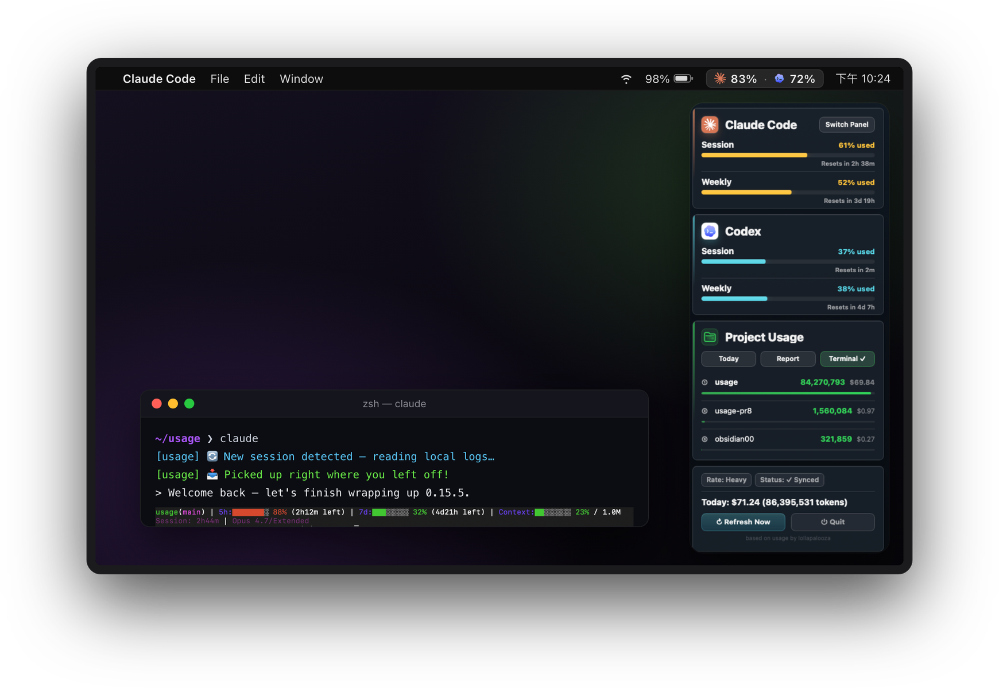
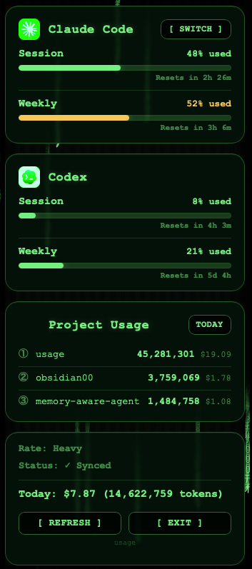

<p align="center">
  
</p>

# usage

### macOS 메뉴 막대에서 Claude Code, Codex, Antigravity 할당량을 확인하세요.

작업하는 동안 Claude Code, Codex, Antigravity 할당량을 계속 확인하세요. `usage`는 세션 한도, 주간 한도, 비용 정보를 macOS 메뉴 막대에 표시하므로 세션이 중단되기 전에 사용량을 관리할 수 있습니다.

[繁體中文](README.zh-TW.md) · [简体中文](README.zh-CN.md) · [English](README.md) · [日本語](README.ja.md) · 한국어 &nbsp;|&nbsp; [Discussions](https://github.com/aqua5230/usage/discussions) &nbsp;|&nbsp; [공식 사이트](https://aqua5230.github.io/usage/)

[](https://github.com/aqua5230/usage/actions/workflows/check.yml)
[](https://github.com/aqua5230/usage/releases/latest)
[](https://www.python.org/)
[](https://www.apple.com/macos/)
[](LICENSE)
[](https://www.bestpractices.dev/projects/13538)

<p align="center">
  
</p>

`usage`는 화면 오른쪽 상단에 **Claude Code, Codex, Antigravity** 할당량을 고정하고, 경고 수준을 한눈에 파악하도록 색상으로 구분합니다. 모든 수치는 이미 컴퓨터에 있는 로컬 파일에서 수동적으로 읽습니다. **Anthropic / OpenAI API를 호출하지 않으며**, **키체인도 읽지 않으므로** 모니터 자체가 token 사용량을 늘리지 않습니다.

## 왜 usage인가요?

세션 중간에 할당량이 소진되면 비용이 큽니다. 특히 Claude Code에 의존하는 긴 리팩터링이나 디버깅 작업에서는 더욱 그렇습니다. `usage`는 한도에 도달하기 *전에* 5시간 및 주간 한도를 표시하고, 작업 내내 계속 보이게 합니다. 실행할 명령이나 열 페이지가 없습니다. 이미 보고 있는 곳에 답이 표시됩니다.

## 빠른 시작

```bash
brew install --cask aqua5230/usage/usage
```

Applications 폴더에 자동으로 설치됩니다. Gatekeeper를 통과하려면 한 번 마우스 오른쪽 버튼으로 클릭해 **Open**을 선택한 뒤 메뉴 막대 아이콘을 클릭하세요. 직접 다운로드하거나 전체 설정 과정을 보고 싶다면 아래 [설치](#설치)를 참고하세요.

## 제공 기능

### 실시간 가시성

- **상시 모니터:** 할당량이 메뉴 막대에 상시 표시되며, 녹색부터 빨간색까지 색상으로 구분됩니다. 전체 세션, 주간, 프로젝트별 내역이 필요하면 클릭하세요.
- **Antigravity 지원:** Antigravity(Gemini)의 세션 및 주간 할당량이 모든 패널에서 세 번째 카드로 나타납니다. 수치는 백그라운드에서 공식 CLI의 `/quota` 명령을 주기적으로 실행해 가져옵니다. 직접 입력하는 것과 같으며 15분 캐시가 적용됩니다.
- **컨텍스트 알림 및 알림 센터:** 컨텍스트 창이 70%에 도달하면 상태 줄이 `/clear` 또는 `/compact`를 안내해 token 낭비를 막습니다. 할당량 한도와 복구에 관한 시스템 알림도 선택해 받을 수 있습니다.
- **섹션 숨기기:** 일부 도구만 사용하나요? 클릭 한 번으로 Claude Code, Codex 또는 Antigravity 섹션을 메뉴 막대와 패널에서 완전히 숨길 수 있습니다.

### 워크플로 도우미

- **진행 상황 컨시어지:** 새 Claude Code 세션을 열면 `usage`가 마지막 요청, 커밋하지 않은 변경 사항, 미완료 todo를 포함한 이전 진행 상황을 바로 AI에 전달합니다. `/resume`도, 요약도 필요 없습니다. 완전히 로컬에서 작동하며 기본값은 꺼짐입니다.
- **Token 절약기:** 메뉴 막대 토글은 Claude Code와 Codex에 해당 세션 동안 더 간결하게 답하도록 요청하여, 코드와 오류 메시지는 바이트 단위로 그대로 유지하면서 출력 token을 절약합니다. 가벼운 메시지별 알림이 긴 대화에서 답변이 다시 장황해지는 것을 막습니다(A/B 테스트: 대화 후반의 답변도 약 40% 더 짧게 유지).
- **Token 낭비 상태 점검:** 매일 백그라운드 진단이 로그를 검사해 반복 파일 읽기, 오염 디렉터리, 장황한 Bash 출력 등을 포함한 낭비를 찾습니다. 문제가 발견되면 한 줄 알림이 표시됩니다. AI에게 "show me"라고 말하면 해결 방법을 안내합니다.

### 보고서와 인사이트

- **심층 HTML 보고서:** 일간 및 주간 token 추세, 프로젝트 순위, 비용을 보여 주는 즉시 공유 가능한 HTML 심층 보고서입니다. 최근 변경 사항을 요약하는 **AI 도구 업데이트 다이제스트**와 기여 히트맵 및 "Wrapped" 요약을 담은 **Year in Review**가 포함됩니다. 한 번 클릭하면 **.html, .csv 또는 .png 이미지**로 저장할 수 있으며, 완전히 오프라인에서 작동하고 프로젝트 이름 마스킹도 선택할 수 있습니다.
- **TUI 및 CLI:** 터미널을 선호하나요? `python3 main.py --tui`로 풍부한 TUI 대시보드를 실행하거나 `python3 usage_cli.py report`로 심층 분석을 생성하세요.

### 경험과 사용자화

- **10가지 시각 테마:** Classic, Matrix, Windows 95, Newspaper, Cloud Observation, Midnight Aquarium, Prism Arcade, Black Hole, World Cup 2026, Lepidoptera(blueprint)를 포함한 패널 스타일을 전환할 수 있습니다.
- **드래그로 순서 변경:** 아무 할당량 카드나 잡고 위아래로 드래그하면 순서를 바꿀 수 있습니다. 배치는 모든 테마에서 공유되며 다시 시작해도 유지됩니다.
- **AI 인재 마켓:** 준비된 AI 팀을 Claude Code에 추가하세요. 엄선된 하위 에이전트 페르소나를 찾아 `~/.claude/agents/`에 즉시 설치할 수 있습니다. 번들 CLI를 통해 완전히 로컬에서 실행됩니다.
- **영적 동반자:** 작은 흰색 애니메이션 실루엣이 사용률 옆에 표시됩니다. Claude에는 불사조, Codex에는 용, Antigravity에는 사자가 함께하며 각자 해당 도구의 token 소모 속도가 올라갈수록 동작도 더 빨라집니다.
- **자동 현지화:** UI 텍스트는 번체 중국어, 간체 중국어, 영어, 일본어, 한국어로 제공되며 시스템 설정에 맞춰 자동으로 전환됩니다.

## 개인정보 보호와 데이터 소스

- 사용량 수치는 컴퓨터의 **로컬 로그 파일에서만** 읽습니다.
- **Anthropic / OpenAI API를 호출하지 않으며**, **키체인도 읽지 않습니다**(macOS의 암호 보관함).
- Antigravity 할당량은 공식 Antigravity CLI 자체의 `/quota` 명령을 로컬에서 실행해 가져옵니다. 직접 입력할 때와 완전히 같습니다. `usage`는 그 API나 token에 직접 접근하지 않습니다.
- 유일한 네트워크 활동은 비용 추정을 위한 공개 모델 가격표 가져오기(오프라인에서는 내장 가격으로 대체)와 가끔 GitHub에서 새 버전을 확인하는 것입니다. **어떤 데이터도 업로드하지 않습니다.**

## 요구 사항

- macOS
- Claude Code, Codex 또는 Antigravity를 한 번 이상 사용한 적이 있어야 합니다(로컬 사용량 데이터가 있어야 함).
- (소스 실행만 해당) Python 3.13.

## 설치

### 1. Homebrew(권장)

Homebrew로 설치하면 `brew upgrade --cask usage` 한 번으로 최신 상태를 유지할 수 있습니다.

```bash
brew install --cask aqua5230/usage/usage
```

*(첫 실행: Finder에서 `usage.app`을 마우스 오른쪽 버튼으로 클릭 → **Open**을 선택해 Gatekeeper를 통과합니다.)*

### 2. App 다운로드

1. [GitHub Releases 페이지](https://github.com/aqua5230/usage/releases/latest)에서 최신 `usage.app.zip`을 다운로드합니다.
2. 압축을 풀고 `usage.app`을 Applications 폴더로 드래그합니다.
3. 첫 실행: Finder에서 `usage.app`을 마우스 오른쪽 버튼으로 클릭 → **Open** → Open을 확인합니다.

### 첫 실행: 상태 줄 설정

Codex를 사용한 적이 있다면 `usage`가 기록을 자동으로 가져옵니다. Claude Code의 경우 앱 팝오버에서 **"Set Up Status Line"** 버튼을 클릭하여 동기화 hook을 설치하세요.
그런 다음 해당 도구를 다시 시작하세요(Claude Code를 Cmd+Q로 완전히 종료한 뒤 다시 엽니다).

설정이 완료되면 Claude Code 창 하단에 다음과 같은 상태 줄이 표시됩니다.

<p align="center">
  
</p>

## 테마 갤러리

UI에서 직접 **10가지 시각 테마**를 전환하세요.

<p align="center">
  
  
  
  
  
  
</p>

## 문제 해결

메뉴 막대에 `--`가 표시되면 대개 고장이 아니라 아직 로컬 데이터가 없다는 뜻입니다.

| 증상 | 가능한 원인 | 해결 방법 |
|---------|--------------|-----|
| 메뉴 막대에 `--` 표시 | 아직 데이터가 없거나 Claude Code hook이 갱신되지 않음 | Codex 대화를 한 번 실행하세요. Claude Code는 "Set Up Status Line"을 클릭하거나 `python3 main.py --setup`을 실행하세요 |
| 실수로 "Quit" 선택 | 프로세스가 종료됨 | Spotlight / Applications에서 `usage.app`을 실행하거나 `launchctl start com.lollapalooza.usage`을 실행하세요 |
| 상태에 "N minutes stale" 표시 | Claude Code가 실행 중이 아님 | Claude Code를 열고 실행 상태로 두세요 |
| Codex 섹션이 비어 있음 | Codex 기록을 찾지 못함 | Codex 대화를 실행하여 로그를 생성하세요 |
| 오늘 비용이 $0.00으로 표시 | 모델 가격 정보 없음 | `~/.usage/pricing_cache.json`을 삭제하거나 `USAGE_DEBUG=1`을 확인하세요 |
| Antigravity 카드가 표시되지 않음 | Antigravity CLI가 설치되지 않았거나 로그인되지 않음 | Antigravity CLI를 설치하고 로그인하세요. 백그라운드 `/quota` 프로브가 성공하면 카드가 자동으로 나타납니다 |
| App이 열리지 않음 | macOS Gatekeeper가 차단함 | Finder에서 `usage.app`을 마우스 오른쪽 버튼으로 클릭 → Open |
| App이 즉시 충돌함(arm64) | 이전 버전의 py2app 번들링 bug | **v0.11.1 이상**으로 업그레이드하세요 |

## 비교

| 기능 | usage | ccusage | TokenTracker |
|---------|:-----:|:-------:|:------------:|
| 화면에 항상 표시 | ✅ | — | ✅ |
| macOS 메뉴 막대 | ✅ | — | ✅ |
| Claude Code 및 Codex 사용량 | ✅ | Claude 전용 | ✅ |
| Antigravity(Gemini) 사용량 | ✅ | — | — |
| HTML 심층 보고서 및 UI | ✅ | ✅ | — |
| AI 인재 마켓 | ✅ | — | — |
| 진행 상황 컨시어지 및 Token 절약기 | ✅ | — | — |
| Token 낭비 상태 점검 | ✅ | — | — |
| API 호출 없음 | ✅ | ✅ | ✅ |
| 오픈 소스 라이선스 | AGPL-3.0 | MIT | — |

## 개발

터미널 TUI 실행, 사용자 지정 에이전트 구성 또는 App 직접 빌드를 원하나요? **[개발 문서](docs/DEVELOPMENT.md)**를 확인하세요.

## 라이선스

AGPL-3.0-only로 라이선스됩니다([LICENSE](LICENSE) 참고). 수정한 버전을 fork하거나 재배포하는 경우, 원저자를 표기하고 다음 링크를 포함해 주세요.
https://github.com/aqua5230/usage

## Star 기록

<a href="https://star-history.com/#aqua5230/usage&Date">
  
</a>
