<p align="center">
  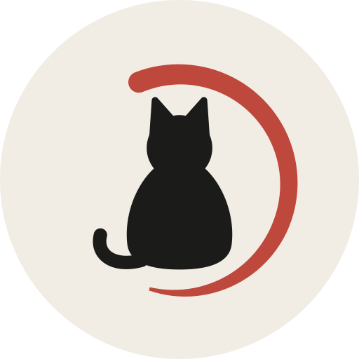
</p>

# usage

### Quota visibility for Claude Code, Codex, and Antigravity, built into the macOS menu bar and Windows system tray.

Running out of quota mid-session is expensive — especially during a long refactor or debugging run that depends on Claude Code. `usage` surfaces 5-hour and weekly limits *before* you hit the wall, and keeps them visible the whole time. There's no command to run and no page to open; the answer is just there, where you already look.

[繁體中文](docs/README.zh-TW.md) · [简体中文](docs/README.zh-CN.md) · English · [日本語](docs/README.ja.md) · [한국어](docs/README.ko.md) &nbsp;|&nbsp; [Discussions](https://github.com/aqua5230/usage/discussions) &nbsp;|&nbsp; [Landing page](https://aqua5230.github.io/usage/)

[](https://github.com/aqua5230/usage/stargazers)
[](https://github.com/aqua5230/usage/actions/workflows/check.yml)
[](https://github.com/aqua5230/usage/releases/latest)
[](https://pypi.org/project/usage-cli/)
[](https://www.python.org/)
[](https://github.com/aqua5230/usage/releases/latest)
[](LICENSE)
[](https://www.bestpractices.dev/projects/13538)

<p align="center">
  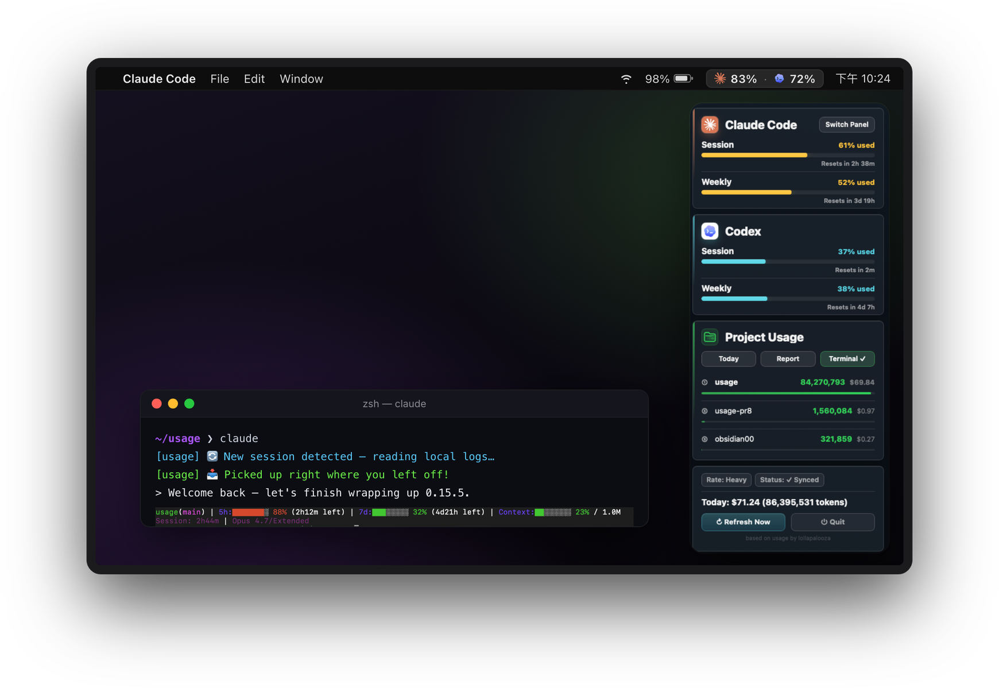
</p>

Claude Code and Codex numbers are read passively from log files already on your machine, so **watching your quota never calls Anthropic or OpenAI's LLM APIs** and never costs you a token. Antigravity is the one exception: its quota comes from Google's official quota endpoint using the sign-in the Antigravity CLI already stores locally — a metadata call that doesn't consume your model quota either.

## Quick Start

```bash
brew install --cask aqua5230/usage/usage
```

**Not on macOS?** `uvx usage-cli` runs the terminal interface anywhere, Linux included — no install, no menu bar.

It lands in your Applications folder automatically. Right-click **Open** once to pass Gatekeeper, then click the menu bar icon. Prefer a direct download or want the full setup flow? See [Install](#install) below.

**Jump to:** [What You Get](#what-you-get) · [Privacy](#privacy--data-sources) · [Requirements](#requirements) · [Install](#install) · [Status Line](#first-launch-set-up-the-status-line) · [Windows](#windows-support) · [Themes](#theme-gallery) · [Troubleshooting](#troubleshooting) · [Comparison](#comparison) · [Not a Fit?](#when-usage-isnt-the-right-fit) · [Development](#development)

## What You Get

### Live Visibility

- **Always-on Monitor:** Your quota lives in the menu bar, color-coded from green to red. Click when you want the full session, weekly, and per-project breakdown.
- **Antigravity Support:** Antigravity (Gemini) session and weekly quota show up as a third card in every theme except World Cup 2026, which stays a two-team HUD. Numbers come straight from the official quota API, using the sign-in the Antigravity CLI already keeps on your machine — refreshed every few minutes, with live reset countdowns.
- **Grok CLI Support:** A fourth card reads Grok CLI's weekly credit percentage straight from its own local debug log — no network call. Grok CLI doesn't expose session or burn-rate data, so the card shows a single weekly bar; its per-request token usage still counts toward today's cost and project totals like Claude Code and Codex.
- **Service Status Alerts:** An orange-red banner appears when Claude Code, Claude API, or Codex API has an outage or degraded performance, read from their public Statuspage.io pages — never an LLM usage API. Antigravity isn't covered; it has no public status page.
- **Context Nudges & Notifications:** When your context window hits 70%, the status line nudges you to `/clear` or `/compact` to prevent token waste. You can also opt-in to system notifications for quota limits and recoveries.
- **Hide Sections:** Only use one or two of the tools? Hide the Claude Code, Codex, Grok CLI, or Antigravity section from the menu bar and panels completely with a single click.

### Workflow Helpers

- **Progress Concierge:** Open a new Claude Code session and `usage` hands your last progress straight to the AI, including your last request, uncommitted changes, and unfinished todos. No `/resume`, no recap. Fully local, off by default.
- **Token Saver:** A menu-bar toggle asks Claude Code and Codex to answer more tersely and in plainer language, saving output tokens while keeping code and error messages byte-exact. A light reminder keeps long conversations from drifting back to verbose — in an A/B test on real sessions, late replies stayed ~40% shorter instead of drifting 84% longer.
- **Terminal Integration:** `usage status --json` hands your Claude Code and Codex quota to any tool that can run a command — Starship, tmux, or your own scripts. Reads the same local files as the menu bar, no network call. [Ready-made snippets](docs/DEVELOPMENT.md#quota-status-for-other-tools-usage-status).
- **Token-waste Health Check:** A daily background diagnosis scans your logs for waste, including repeated file reads, polluter directories, and noisy Bash output. If it finds issues, a one-line heads-up appears; say "show me" and the AI walks you through fixes.

### AI Teamwork

- **AI Talent Market:** Bring a ready-made AI team into Claude Code. Browse and install curated subagent personas into `~/.claude/agents/` instantly. Runs fully locally via the bundled CLI.
- **AI Council:** Open a dedicated window and run a multi-round discussion between Claude Code, Codex, and Antigravity — pick participants, models, and a debate style, with a token estimate up front. Steer it between rounds, see who dissents in the consensus tally, and let it stop early once everyone agrees. Seats can wear AI Talent Market personas and reference real files via an optional read-only folder.
- **AI Update Daily:** Opens a daily-updated public [page](https://aqua5230.github.io/ai-updates/) covering Claude Code, Codex, and Antigravity, with the full history kept. Reviewed items get a plain-language summary in all five UI languages; unreviewed ones show the original source text.

### Reporting & Insight

- **Deep HTML Reports:** Shareable HTML reports of daily and weekly token trends, project rankings, and cost — including a Year in Review with a contribution heatmap and "Wrapped" summary. A "What you worked on" section lists the names Claude Code gave your recent conversations, so the numbers arrive with context. Export as .html, .csv, or .png, fully offline, with optional project-name masking that covers those titles too.

### Experience & Customization

- **14 Visual Themes:** Switch between panel styles including Classic, Matrix, Windows 95, Newspaper, Cloud Observation, Midnight Aquarium, Prism Arcade, Black Hole, World Cup 2026, Lepidoptera (blueprint), Migration, Stained Glass, Origami, and Catppuccin (official palette, all four flavors).
- **Place the Panel Anywhere:** The panel is no longer pinned under the menu bar icon. Drag it from any empty spot to wherever you want it, and it reopens there next time. It stays put when another app takes focus — a second click on the menu bar icon, or Escape, closes it.
- **Drag to Reorder:** Grab any quota card and drag it up or down to swap the order — the arrangement is shared across every theme with quota cards (all except World Cup 2026) and survives restarts.
- **Automatic Localization:** UI text is available in Traditional Chinese, Simplified Chinese, English, Japanese, and Korean, automatically matching your system settings.

## Privacy & Data Sources

- Claude Code and Codex numbers are read **only from local log files** on your machine; reading them **never calls Anthropic or OpenAI's LLM APIs**.
- Antigravity quota requires network access, and only if you use it: quota is fetched from Google's official quota endpoint using the OAuth credential the Antigravity CLI already stored after sign-in — read from macOS Keychain, Windows Credential Manager, or a local token file depending on CLI version. `usage` reads that credential without writing it back and keeps any refreshed access token in memory only; the call itself only reads quota metadata and never consumes your model quota.
- Background network activity: the Antigravity quota/token endpoints above, public Claude and Codex status pages to flag outages, a public model-pricing table to estimate cost (falls back to built-in prices offline), and occasionally checking GitHub for a new version. Claude Code and Codex log contents are never uploaded.

## Requirements

- macOS 12 (Monterey) or newer, or Windows 10/11
- Claude Code, Codex, or Antigravity has been used at least once (so local usage data exists).
- (Source runs only) Python 3.13.

## Install

### 1. Homebrew (Recommended)

Installing via Homebrew means a single `brew upgrade --cask usage` keeps it current.

```bash
brew install --cask aqua5230/usage/usage
```

*(First launch: right-click `usage.app` in Finder → **Open** to pass Gatekeeper).*

### 2. Download for macOS

1. Download the latest `usage.app.zip` from the [GitHub Releases page](https://github.com/aqua5230/usage/releases/latest).
2. Unzip it and drag `usage.app` into your Applications folder.
3. First launch: in Finder, right-click `usage.app` → **Open** → confirm Open.

### 3. uvx (zero install, any OS)

Run `uvx usage-cli` to open the terminal interface directly. uv automatically prepares Python 3.13, so no separate Python installation is needed.

For a persistent command, run `uv tool install usage-cli`, then use `usage` (for example, `usage status --json`). This installation path provides the CLI only, not the menu bar app.

On Linux, `usage setup` installs the Claude Code status line as well, so quota shows up under your prompt the same way it does on macOS and Windows. CI verifies this on Ubuntu. The menu bar and system tray apps remain macOS- and Windows-only.

## First Launch: Set Up the Status Line

If you've used Codex, `usage` picks up its history automatically. For Claude Code, click the **"Set Up Status Line"** button in the app popover to install the sync hook.
Restart the relevant tool afterward (on macOS, fully Cmd+Q Claude Code and re-open it; on Windows, restart your terminal or start a new session).

The same button also sets up a status line for the Antigravity CLI when it is installed on your machine, and does nothing at all when it isn't. Any status line you configured there yourself is backed up first and restored when you turn the switch off.

Once set up, the bottom of the Claude Code window will show a status line like this:

<p align="center">
  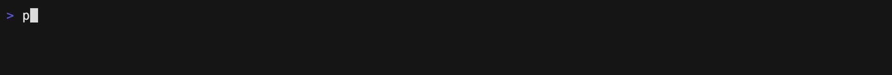
</p>

## Windows Support

Windows has the full core experience: the system-tray UI, Claude Code status-line hook, and Codex history parsing all work natively. Download `usage-windows.zip` from the [latest GitHub Release](https://github.com/aqua5230/usage/releases/latest), unzip it, then run `usage.exe`—no installer is needed. The tray UI requires Microsoft Edge WebView2 Runtime, which is normally included with Windows 10 and 11.

The system-tray icon updates with your Claude quota percentage; its tooltip summarizes the Claude and Codex windows. Left-click opens the same 14 quota themes available on macOS (Classic plus the other thirteen) in WebView2. Right-click provides Reset Panel Position and Quit; panel switching, refresh, launch at login, and update checks are in the panel menu.

Windows differences: the panel opens at the bottom-right of the working area rather than next to the tray icon; update prompts use a system Yes/No dialog; and the AI Talent Market and AI Council panels are macOS-only.

### Code signing policy

Free code signing provided by [SignPath.io](https://about.signpath.io/), certificate by [SignPath Foundation](https://signpath.org/).

Team roles:

- Committers and reviewers: [aqua5230](https://github.com/aqua5230)
- Approvers: [aqua5230](https://github.com/aqua5230)

Privacy policy: this program will not transfer any information to other networked systems unless specifically requested by the user or the person installing or operating it. See [Privacy & Data Sources](#privacy--data-sources) for the network calls `usage` makes on your behalf and how to avoid them.

## Theme Gallery

Switch between **14 visual themes** directly from the UI:

<p align="center">
  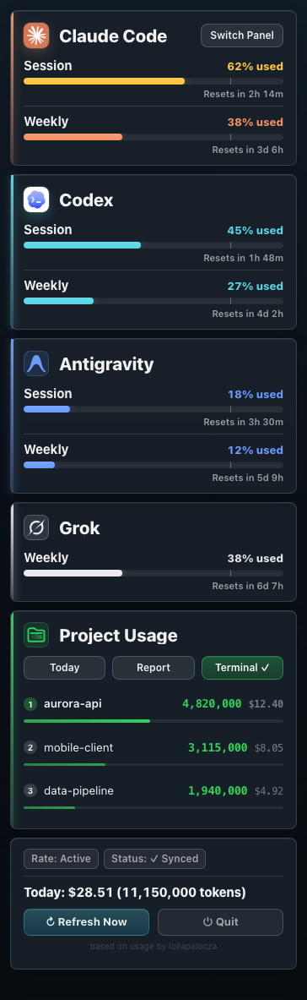
  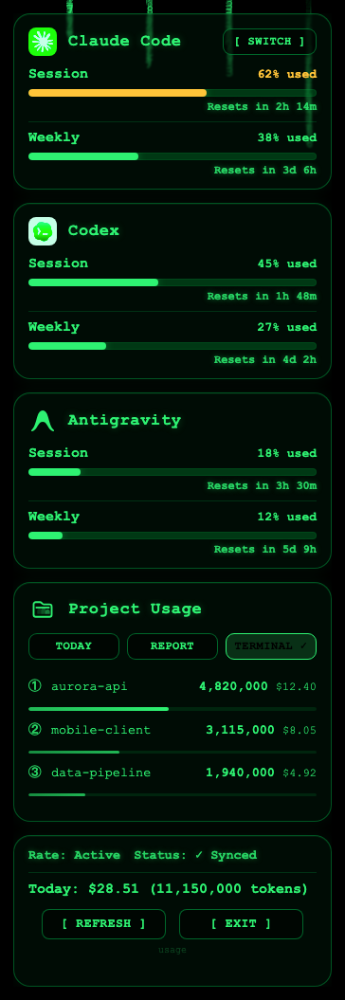
  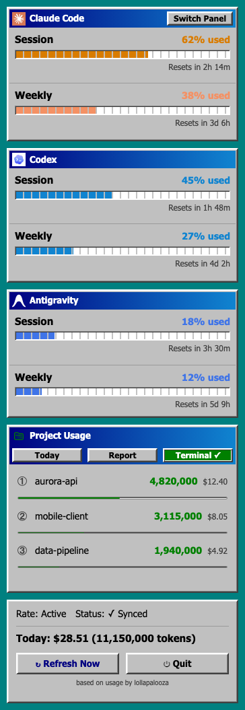
  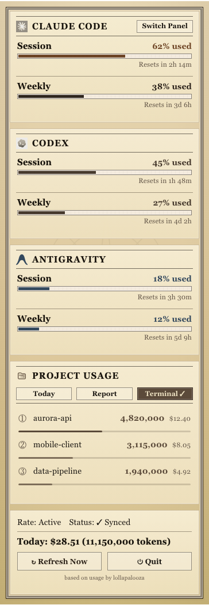
  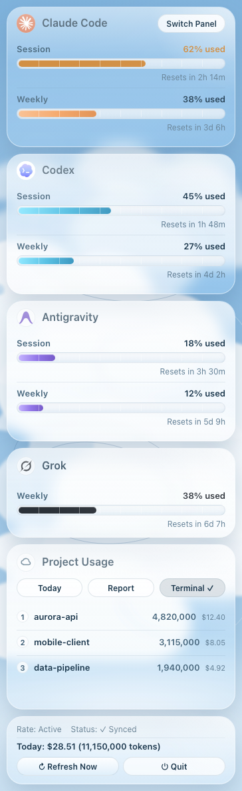
  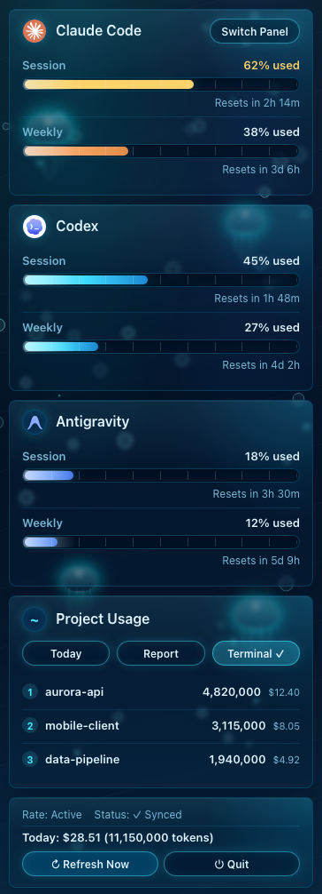
  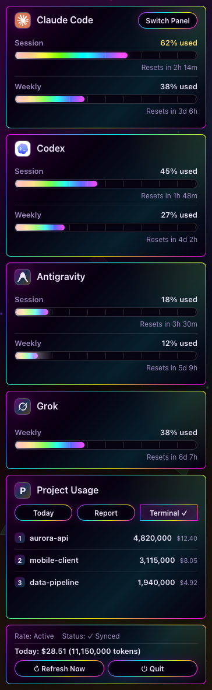
  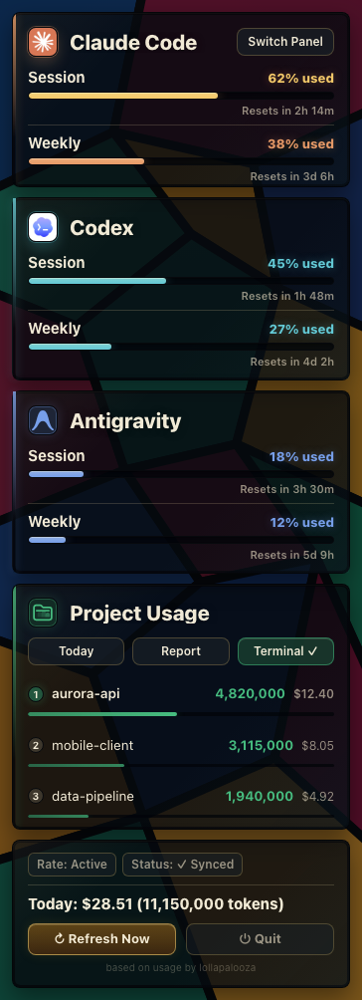
  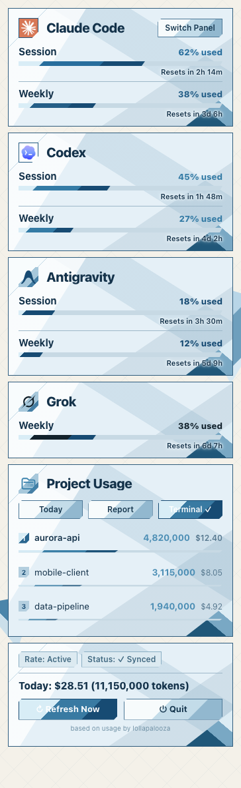
  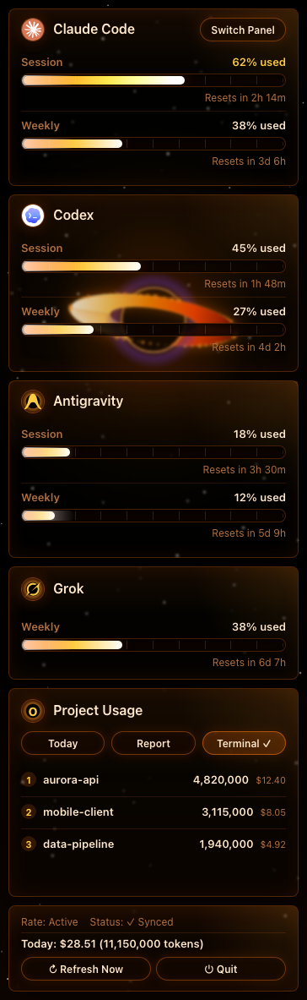
  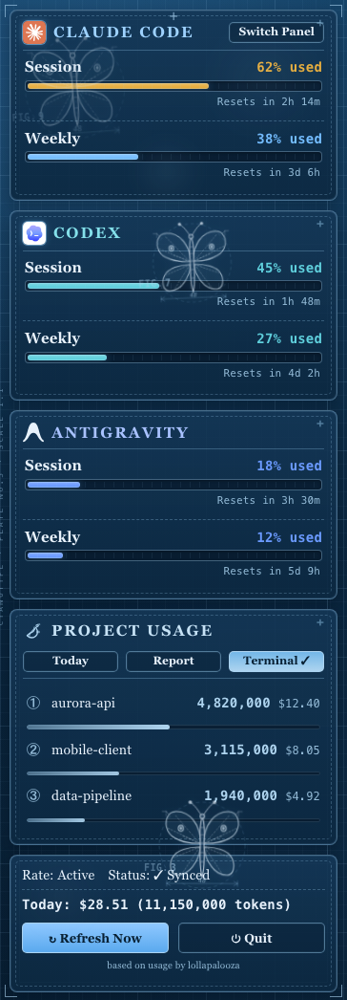
  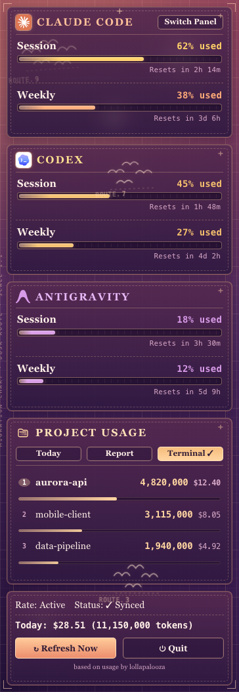
  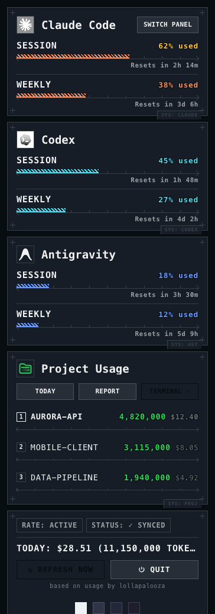
</p>

## Troubleshooting

If the menu bar shows `--`, it's usually not broken — there's just no local data yet.

| Symptom | Likely cause | Fix |
|---------|--------------|-----|
| Menu bar shows `--` | No data yet, or Claude Code hook not refreshed | Run one Codex conversation. For Claude Code, click "Set Up Status Line" (from source: `python3 main.py --setup`) |
| `ImportError` from `main.py` inside `usage.app` | The bundled `main.py` needs the bundle's own interpreter and cannot be run by hand | Don't run that copy. Click "Set Up Status Line" in the app, or clone the repo to run from source |
| Accidentally hit "Quit" | Process terminated | Relaunch `usage.app` from Spotlight or Applications. (`launchctl start com.lollapalooza.usage` only works if you enabled Launch at Login.) |
| Status says "N minutes stale" | Claude Code isn't running | Open Claude Code and let it run |
| Codex section is empty | No Codex history found | Run a Codex conversation to generate logs |
| Today's cost shows $0.00 | Model pricing missing | Delete `~/.usage/pricing_cache.json` or check `USAGE_DEBUG=1` |
| Antigravity card is missing | Antigravity CLI not installed or not signed in | Install and sign in to the Antigravity CLI; the card appears automatically once a background quota fetch succeeds |
| App won't open | macOS Gatekeeper blocked it | Right-click `usage.app` in Finder → Open |

## Comparison

| Feature | usage | ccusage | TokenTracker |
|---------|:-----:|:-------:|:------------:|
| Always on screen | ✅ | — | ✅ |
| macOS menu bar & Windows system tray | ✅ | — | macOS only |
| Claude Code & Codex usage | ✅ | Claude only | ✅ |
| Antigravity (Gemini) usage | ✅ | — | — |
| Grok CLI usage | ✅ | — | — |
| Claude Code & Codex service-status alerts | ✅ | — | — |
| HTML deep reports & UI | ✅ | ✅ | — |
| AI Talent Market | macOS only | — | — |
| AI Council | macOS only | — | — |
| AI Update Daily | ✅ | — | — |
| Progress Concierge & Token Saver | ✅ | — | — |
| Token-waste Health Check | ✅ | — | — |
| No LLM API calls to read quota | ✅ | ✅ | ✅ |
| Open-source license | AGPL-3.0 | MIT | — |

## When usage Isn't the Right Fit

- You only live in the terminal and don't want another menu bar icon running in the background — a one-off CLI check fits better.
- You don't use Claude Code, Codex, or Antigravity — there's no local usage data for `usage` to read.
- You're on Linux — only macOS and Windows are supported today.

## Development

Building from source, configuring custom agents, or running the terminal TUI? See the **[development docs](docs/DEVELOPMENT.md)**.

## License

Licensed under AGPL-3.0-only (see [LICENSE](LICENSE)). If you fork or redistribute a modified version, please credit the original author and link back to:
https://github.com/aqua5230/usage
