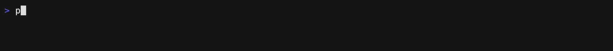
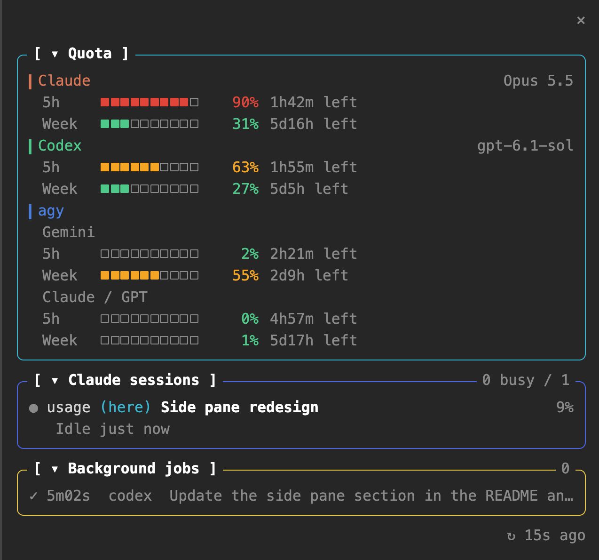
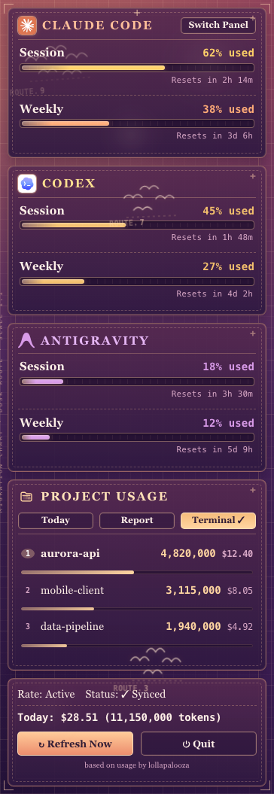

<p align="center">
  
</p>

# usage

### Your Claude Code, Codex, Antigravity and Grok CLI quota, always on screen.

`usage` puts your 5-hour and weekly limits in the macOS menu bar or Windows system tray, colored from green to red. Hitting the limit halfway through a long refactor is a bad way to find out you were running low. Now you see it coming. There's nothing to run and no page to open.

[繁體中文](docs/README.zh-TW.md) · [简体中文](docs/README.zh-CN.md) · English · [日本語](docs/README.ja.md) · [한국어](docs/README.ko.md) &nbsp;|&nbsp; [Discussions](https://github.com/aqua5230/usage/discussions) &nbsp;|&nbsp; [Landing page](https://aqua5230.github.io/usage/)

[](https://github.com/aqua5230/usage/stargazers)
[](https://github.com/aqua5230/usage/actions/workflows/check.yml)
[](https://github.com/aqua5230/usage/releases/latest)
[](https://pypi.org/project/usage-cli/)
[](https://www.python.org/)
[](https://github.com/aqua5230/usage/releases/latest)
[](LICENSE)
[](https://www.bestpractices.dev/projects/13538)

<p align="center">
  
</p>

- **Every quota at a glance:** Claude Code, Codex, and Antigravity session and weekly limits with reset countdowns, plus Grok CLI's weekly credit.
- **Reads what's already on your machine:** Claude Code, Codex, and Grok CLI numbers come from local logs. Antigravity quota comes from Google's official endpoint, using the sign-in its CLI already stores.
- **Warns before tokens go to waste:** The Claude Code status line flags a bloating context window and a cold prompt cache. A banner shows Claude or Codex outages.
- **Helpers inside Claude Code:** A side pane, shorter replies, a progress hand-off for new sessions, and quota-aware planning. All optional.
- **Reports and 16 themes:** HTML reports of token trends and cost, and 16 panel themes to pick from.

## Install

Runs on macOS 12 or newer and Windows 10/11.

**macOS, with Homebrew (recommended):**

```bash
brew install --cask aqua5230/usage/usage
```

It lands in your Applications folder, and `brew upgrade --cask usage` keeps it current. Prefer a direct download? Get `usage.app.zip` from the [latest release](https://github.com/aqua5230/usage/releases/latest), unzip it, and drag `usage.app` into Applications.

**First launch on macOS:** if macOS 15 or later blocks it, open System Settings → Privacy & Security, scroll down, and click **Open Anyway**. On macOS 14 or earlier, right-click `usage.app` in Finder → **Open** once. Then click the menu bar icon.

**Windows:** download `usage-windows.zip` from the [latest release](https://github.com/aqua5230/usage/releases/latest), unzip it, and run `usage.exe`. No installer is needed. If SmartScreen shows **Windows protected your PC**, click **More info** → **Run anyway**. See [Windows Support](#windows-support).

**Terminal only, any OS (Linux included):** `uvx usage-cli` opens the terminal interface with nothing to install; uv prepares Python 3.13 by itself. For a persistent `usage` command, run `uv tool install usage-cli`. On Linux, `usage setup` installs the Claude Code status line too. This path has no menu bar or tray app.

`usage` needs data from at least one of Claude Code, Codex, Antigravity, or Grok CLI, or a running Claude Desktop app.

## First Launch: Set Up the Status Line

If you've used Codex, `usage` picks up its history automatically. For Claude Code, click the **"Set Up Status Line"** button in the app popover to install the sync hook.
Restart the relevant tool afterward (on macOS, fully Cmd+Q Claude Code and re-open it; on Windows, restart your terminal or start a new session).

The same button also sets up a status line for the Antigravity CLI and for Grok CLI when they are installed on your machine, and does nothing at all when they aren't. Any status line you configured there yourself is backed up first and restored when you turn the switch off.

Once set up, the bottom of the Claude Code window will show a status line like this:

<p align="center">
  
</p>

## What You Get

### On Screen

- **Menu bar monitor:** Quota color-coded from green to red. Click for the full session, weekly, and per-project breakdown.
- **Antigravity card:** Shows the Gemini pool by default. Tap the `Gemini ⇄` tag to switch to the separate Claude / GPT pool; the choice is remembered.
- **Grok CLI card:** The weekly credit percentage from Grok CLI's local debug log. Its tokens also count toward cost and project totals.
- **Muse Code spending:** Its tokens and cost count toward today's cost, project totals, reports, and the CLI. Muse keeps no quota data locally, so it has no card.
- **Outage alerts:** An orange-red banner when Claude Code, Claude API, or Codex API is down or degraded, read from their public status pages.
- **Context and cache warnings:** The status line nudges you to `/clear` or `/compact` before the context window bloats, and says why the prompt cache missed.
- **Hide what you don't use:** Hide the Claude Code, Codex, Grok CLI, or Antigravity section from the menu bar and panels in one click.

### Inside Claude Code

- **Progress Concierge:** A new session starts with your last request, uncommitted changes, and unfinished todos already handed to the AI. No `/resume`, no recap. Off by default.
- **Token Saver:** Asks Claude Code and Codex for shorter, plainer replies while keeping code and error messages byte-exact. In an A/B test on real sessions, late replies stayed ~40% shorter instead of drifting 84% longer.
- **Side pane:** Quotas, other conversations, and background jobs next to your work. [See the side pane](#claude-code-side-pane).
- **Beginner Mode:** Explains up to three technical terms from each answer in one plain line, then brings them back for review. Off by default; uses a little Claude quota.
- **Quota-Aware Mode:** When a quota runs low, Claude tells you before a big task that would use it, and lets you do a smaller part or wait for the reset. Off by default; makes no extra model calls.
- **Auto-start 5-hour session:** Right after a 5-hour quota resets, sends each tool one tiny message so the next window starts counting right away. Off by default.
- **Token-waste health check:** A daily scan of your logs for repeated file reads and noisy output. Say "show me" and the AI walks you through fixes.

### Reports and More

- **HTML reports:** Daily and weekly token trends, project rankings, cost, and a Year in Review with a contribution heatmap. Export .html, .csv, or .png fully offline, with optional project-name masking.
- **Terminal integration:** `usage status --json` hands your Claude Code, Codex, Antigravity, and Grok quota to Starship, tmux, or your own scripts. [Ready-made snippets](docs/DEVELOPMENT.md#quota-status-for-other-tools-usage-status).
- **AI Update Daily:** A daily public [page](https://aqua5230.github.io/ai-updates/) of Claude Code, Codex, and Antigravity changes, with plain-language summaries in five languages.
- **Your layout:** Drag the panel anywhere, drag quota cards to reorder them, and switch among 16 themes. The UI follows your system language: Traditional Chinese, Simplified Chinese, English, Japanese, or Korean.

<details>
<summary>Thresholds, versions, and fine print</summary>

- **Context colors:** The context figure turns yellow at 50% or 200K tokens and red at 80% or 400K tokens, whichever comes first. The nudge appears at 70%, or earlier when the context is filling fast. When the color changes, the status line shows the image count and the estimated share of files and command output.
- **Prompt cache:** The hit rate needs Claude Code 2.1.251 or newer. For 10 minutes after a miss, the status line says why — the model changed, the tools changed, you sat idle past the 5-minute TTL, and so on; that needs 2.1.260 or newer. On older versions those parts don't appear.
- **Notifications:** Opt in to system notifications for quota limits and recoveries.
- **Antigravity card:** Refreshed every few minutes. It appears in every theme except World Cup 2026, which stays a two-team HUD.
- **Outage alerts:** Antigravity isn't covered; it has no public status page.
- **Token-waste health check:** It also flags polluter directories and noisy Bash output.
- **Linux:** CI verifies `usage setup` on Ubuntu.
- **Progress Concierge:** When you `/resume` a conversation that sat long enough for its cache to expire, it warns how many tokens the next message will re-send and suggests `/compact` first.
- **Beginner Mode (macOS and Windows):** Terms appear above the prompt in your UI language. Press 9 to mark them understood; skipped terms come back after 1, 3, then 7 days. Understood terms return as a one-question multiple-choice quiz 7, 21, then 60 days later, at most one a day, and a wrong answer puts the term back in the hints. `/terms` opens your term history. Picking terms asks Claude Haiku through your Claude Code, and pauses while your 5-hour quota is at 90% or more.
- **Quota-Aware Mode (macOS and Windows):** Claude Code gets one line with what is left and when it resets when a 5-hour quota passes 80%, 90%, or 95%, or a weekly quota passes 95%. It covers Claude Code, Codex, and Antigravity, says each level once per conversation, and treats each quota and model group separately, so a used-up one only matters for work that runs on it.
- **Auto-start 5-hour session:** Claude gets Haiku, Antigravity gets Gemini 3.8 Flash Low, and Codex gets its cheapest model. The quota used is negligible. Checking your quota never sends a message; only this switch does.
- **Panel:** It stays put when another app takes focus; a second click on the menu bar icon, or Escape, closes it. Card order is shared across every theme with quota cards (all except World Cup 2026) and survives restarts.
- **HTML reports:** A "What you worked on" section lists the names Claude Code gave your recent conversations, and masking covers those titles too.
- **AI Update Daily:** Unreviewed items show the original source text. The full history is kept.
- **Release notes:** The first launch after an update shows what changed in that version, once, in your UI language. Fresh installs skip it.

</details>

## Claude Code Side Pane

See your quota, other conversations, and background jobs without leaving Claude Code. Available on macOS and Windows.

<p align="center"></p>

**What you’ll see**

- **Quotas:** Your 5-hour and weekly limits.
- **Claude conversations:** Conversations waiting for your permission or MCP input are marked in yellow.
- **Conversation notifications:** A notification, starting with the project name, appears when another Claude conversation finishes or starts waiting for you.
- **Latest reply:** Each conversation row shows the latest assistant reply on its second line.
- **Background jobs:** Includes subagents started by Claude with the Agent tool and their status.

**How to enable**

1. In the usage menu bar menu (macOS) or system-tray menu (Windows), open the **Claude Code** submenu and check **Side pane**.
2. Open a new conversation or run `/reload-plugins`.
3. At terminal widths ≥144 columns, the pane opens on the right automatically. In narrower terminals, enter `/usage-dash`.

<details>
<summary>Compatibility and updates</summary>

- Requires a recent Claude Code with mod support; tested with 2.1.289.
- The pane docks on the right only in Claude Code's fullscreen layout; otherwise it appears above the prompt. On Windows, enabling the pane turns the fullscreen layout on as well, and turning the pane off switches it back.
- The built-in macOS Terminal supports only 256 colors and may show a gray background. Select an ANSI dark theme in `/config`.
- When the usage app starts, it automatically updates an enabled pane to the bundled version.

</details>

## Privacy & Data Sources

- **Local logs:** Claude Code, Codex, Grok CLI, and Muse Code numbers are read from log files on your machine. Their contents are never uploaded.
- **Claude Desktop:** Without the Claude Code CLI or a status line, keep Claude Desktop open and `usage` reads its local plan-usage history. No cookies, login tokens, or API calls are needed. Reset times appear only when its local cache confirms them; they are never estimated.
- **Antigravity**, only if you use it, needs network access: quota is fetched from Google's official quota endpoint with the OAuth credential the Antigravity CLI already stored after sign-in — read from macOS Keychain, Windows Credential Manager, or a local token file depending on CLI version. `usage` never writes that credential back and keeps any refreshed access token in memory only; the call itself reads quota metadata.
- **Other background network activity:** Public Claude and Codex status pages to flag outages, a public model-pricing table to estimate cost (built-in prices are used offline), and an occasional GitHub check for a new version.
- **Beginner Mode**, only if you turn it on, sends Claude Code's latest answer to Claude Haiku through your own Claude Code sign-in to pick terms. Your term list stays in `~/.usage/glossary.json`.

<details>
<summary>How Claude Desktop quota is read</summary>

When Claude Code quota files are unavailable, `usage` reads Claude Desktop's local `plan-usage-history.json`, including Microsoft Store installations on Windows. When a recent response in its local Chromium block-file HTTP cache matches the organization, `usage` also reads the exact session and weekly reset times. Newer cached observations take precedence over throttled history samples; older cache must match the percentages. Missing, unsupported, expired, or inconsistent cache data leaves the countdown unknown.

Desktop samples normally update every 5–15 minutes. The panel shows the observation age, marks it stale after 30 minutes, and stops displaying it after two hours. The most recent organization sample is used; custom desktop profiles are not discovered. These quota caches contain no per-project token counts. Desktop sessions that also write compatible Claude Code logs under `~/.claude/projects/` are counted by the existing project/token reports.

</details>

## Windows Support

Windows has the full core experience: the system-tray UI with the same 16 themes as macOS, the Claude Code status-line hook, and Codex history parsing all work natively. The tray UI requires Microsoft Edge WebView2 Runtime, which is normally included with Windows 10 and 11.

<details>
<summary>Tray icon, taskbar label, and other differences</summary>

The system-tray icon shows the remaining session quota percentage for Claude or Codex. Choose **Tray Display Source → Claude Code / Codex** in the right-click menu or panel menu; the change applies immediately and survives restarts (default: Claude). If Codex has no session window, the icon uses its weekly quota instead and the tooltip identifies that window. Missing quota data shows `--`. The tooltip summarizes both tools, with the selected source first. Left-click opens the quota themes in WebView2. Right-click also provides Reset Panel Position and Quit; panel switching, refresh, launch at login, and update checks are in the panel menu.

Enable **Show Taskbar Quota** in either menu for a transparent `Codex: 92%` label inside the taskbar, immediately left of the notification area. It follows taskbar position, scaling, and light/dark theme, and hides during fullscreen use or taskbar auto-hide. Click the label to open the panel. If buttons leave insufficient space, it moves just outside the taskbar. The normal app icon remains as a menu entry point; the label follows the selected source and quota window. Right-click the label to open the same menu as the tray icon.

The panel opens at the bottom-right of the working area rather than next to the tray icon, and update prompts use a system Yes/No dialog.

</details>

### Code signing policy

Free code signing provided by [SignPath.io](https://about.signpath.io/), certificate by [SignPath Foundation](https://signpath.org/).

Team roles:

- Committers and reviewers: [aqua5230](https://github.com/aqua5230)
- Approvers: [aqua5230](https://github.com/aqua5230)

Privacy policy: this program will not transfer any information to other networked systems unless specifically requested by the user or the person installing or operating it. See [Privacy & Data Sources](#privacy--data-sources) for the network calls `usage` makes on your behalf and how to avoid them.

## Theme Gallery

Switch between **16 visual themes** directly from the UI:

<p align="center">
  
  
  
  
</p>

<details>
<summary>See the other 12 themes</summary>

<p align="center">
  
  
  
  
  
  
  
  
  
  
  
  
</p>

</details>

## Troubleshooting

If the menu bar shows `--`, it's usually not broken — there's just no local data yet.

| Symptom | Likely cause | Fix |
|---------|--------------|-----|
| Menu bar shows `--` | No data yet, or Claude Code hook not refreshed | Run one Codex conversation. For Claude Code, click "Set Up Status Line" (from source: `python3 main.py --setup`) |
| `ImportError` from `main.py` inside `usage.app` | The bundled `main.py` needs the bundle's own interpreter and cannot be run by hand | Don't run that copy. Click "Set Up Status Line" in the app, or clone the repo to run from source |
| Accidentally hit "Quit" | Process terminated | Relaunch `usage.app` from Spotlight or Applications. (`launchctl start com.lollapalooza.usage` only works if you enabled Launch at Login.) |
| Status says "N minutes stale" | Claude Code isn't running | Open Claude Code and let it run |
| Codex section is empty | No Codex history found | Run a Codex conversation to generate logs |
| Today's cost shows $0.00 | Model pricing missing | Delete `~/.usage/pricing_cache.json` or check `USAGE_DEBUG=1` |
| Antigravity card is missing | Antigravity CLI not installed or not signed in | Install and sign in to the Antigravity CLI; the card appears automatically once a background quota fetch succeeds |
| App won't open | macOS Gatekeeper blocked it | See [First launch on macOS](#install) |
| Windows shows "Windows protected your PC" | SmartScreen doesn't recognize the download yet | Click More info → Run anyway |

## Comparison

| Feature | usage | ccusage | TokenTracker |
|---------|:-----:|:-------:|:------------:|
| Always on screen | ✅ | — | ✅ |
| macOS menu bar & Windows system tray | ✅ | — | macOS only |
| Claude Code & Codex usage | ✅ | ✅ | ✅ |
| Antigravity usage (Gemini and Claude / GPT) | ✅ | — | — |
| Grok CLI usage | ✅ | — | — |
| Muse Code token spend | ✅ | — | — |
| Claude Code & Codex service-status alerts | ✅ | — | — |
| HTML deep reports & UI | ✅ | ✅ | — |
| Claude Code helpers (Token Saver, Progress Concierge, Beginner and Quota-Aware modes, health check) | ✅ | — | — |
| AI Update Daily | ✅ | — | — |
| Open-source license | AGPL-3.0 | MIT | — |

## When usage Isn't the Right Fit

- You only live in the terminal and don't want another menu bar icon running in the background — a one-off CLI check fits better.
- You don't use Claude Code, Codex, Antigravity, Grok CLI, or Claude Desktop — there's no usage data for `usage` to read.
- You want a menu bar on Linux. Only macOS and Windows have one today, though the terminal interface (`uvx usage-cli`) runs on Linux.

## Development

Building from source, configuring custom agents, or running the terminal TUI? See the **[development docs](docs/DEVELOPMENT.md)**.

## License

Licensed under AGPL-3.0-only (see [LICENSE](LICENSE)). If you fork or redistribute a modified version, please credit the original author and link back to:
https://github.com/aqua5230/usage
