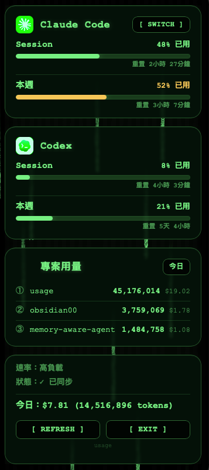

<p align="center">
  
</p>

# usage

### 把 Claude Code 與 Codex 額度直接放進 macOS 選單列

讓 Claude Code 與 Codex 的額度在工作時持續可見。`usage` 把 session 限額、每週限額與成本脈絡放進 macOS 選單列，讓你在工作被打斷前就先掌握用量。

繁體中文 · [English](README.md) &nbsp;|&nbsp; 💬 [Discussions](https://github.com/aqua5230/usage/discussions) &nbsp;|&nbsp; 🌐 [官方介紹頁](https://aqua5230.github.io/usage/)

[](https://github.com/aqua5230/usage/actions/workflows/check.yml)
[](https://github.com/aqua5230/usage/releases/latest)
[](https://www.python.org/)
[](https://www.apple.com/macos/)
[](LICENSE)
[](https://www.bestpractices.dev/projects/13538)

<p align="center">
  
</p>

`usage` 把 **Claude Code 與 Codex** 的額度釘在螢幕右上角的選單列，用顏色標好警戒級別，掃一眼就懂。每個數字都被動讀自你機器上原本就在寫的本機檔案。它**不呼叫 Anthropic / OpenAI 的 API，也不讀 Keychain**，所以這個監看器本身永遠不會增加你的用量。

## 💡 為什麼需要 usage？

- 🧱 **在額度中斷工作前先看到風險。** 當長時間重構或除錯依賴 Claude Code 時，無預警撞到上限的代價很高。
- ❓ **用即時可見性取代猜測。** 5 小時與每週限額，不必等撞牆後才知道。
- 🔁 **把答案放在你本來就在看的地方。** CLI 只有在你停下來輸入時才會回應；`usage` 則持續在畫面上，不用跑指令，也不用開頁面。

## 🚀 快速上手

```bash
brew install --cask aqua5230/usage/usage
```

安裝後會自動進入「應用程式」資料夾。先右鍵**「打開」**一次讓 Gatekeeper 放行，再點選單列圖示即可。想直接下載，或想看完整設定流程？見下方 [安裝](#-安裝)。

## ✨ 你會得到什麼

### 即時可見性

- 👁️ **常駐監控：** 額度常駐選單列，顏色標示警戒級別（綠到紅）。點開能看 Session、Weekly 與各專案用量細節。
- 🔔 **上下文提醒與系統通知：** Context Window 達 70% 時，狀態列會提醒你 `/clear` 或 `/compact` 來避免浪費；也可自選開啟系統通知，在接近門檻或額度恢復時提醒。
- 🎛️ **獨立隱藏區塊：** 只用其中一套工具？一鍵就能把 Claude Code 或 Codex 從選單列及面板上徹底隱藏。

### 工作流程輔助

- 🧠 **進度管家 (Progress Concierge)：** 開新對話時，自動把你上次的請求、未提交的 commits 與待辦清單交給 AI，不用重講一遍進度。完全本機、預設關閉。
- 🤐 **省 token 模式 (Token Saver)：** 一鍵讓 Claude Code 與 Codex 講話更精簡，省下輸出 token，但程式碼與錯誤訊息保證一個字都不縮水。之後每則訊息還會輕聲提醒維持精簡，長對話也不走鐘（A/B 實測：對話後段回覆少約 40%）。
- 🩺 **Token 浪費健檢：** 每日背景診斷重複讀取檔案、污染目錄與雜訊輸出。當發現浪費時會有一行提示，AI 也能帶你看懂問題並給出改善建議。

### 報告與洞察

- 📊 **深度 HTML 報告：** 視覺化呈現每日與每週趨勢、專案排行與成本。包含整理近期工具更新的 **AI Tool Update Digest**，以及帶有貢獻熱力圖與 Wrapped 摘要的 **Year in Review**。一鍵另存 **.html／.csv／.png 圖卡**分享，全程離線、可選擇隱藏專案名稱。
- 💻 **TUI 與 CLI 支援：** 偏好終端機的話，可用 `python3 main.py --tui` 開 Rich TUI 面板，或用 `python3 usage_cli.py report` 產出深度分析報告。

### 體驗與客製化

- 🎨 **10 款視覺面板：** 可在 Classic、Matrix、Windows 95、Newspaper、Cloud Observation、Midnight Aquarium、Prism Arcade、Black Hole、World Cup 2026 與 Lepidoptera（藍曬圖）之間切換。
- 🧑‍💼 **AI 人才市場：** 將整個 AI 團隊帶進 Claude Code。瀏覽並一鍵將精選 subagent persona 安裝到 `~/.claude/agents/`，全程透過內建 CLI 在本機完成。
- 🐉 **神獸夥伴：** 百分比旁常駐一隻小型白色動畫神獸（Claude 是鳳凰，Codex 是飛龍），會跟著 token 燃燒率動態加速。
- 🌍 **自動多語言 (i18n)：** 介面支援繁中、簡中、英、日、韓，自動跟隨系統語言設定。

## 🔒 隱私與資料來源

- 用量數字**只讀本機紀錄檔**。
- **絕對不呼叫 Anthropic / OpenAI API，不讀 Keychain**（macOS 內建密碼保險箱）。
- 唯二連網：抓公開價格表估算成本（斷網會用內建預設），以及偶爾檢查 GitHub 版本更新。**不會上傳任何資料。**

## ⚙️ 環境需求

- macOS
- 已經使用過 Claude Code 或 Codex（需有本機用量資料）
- （僅限從原始碼跑）Python 3.13

## 📦 安裝

### 1. Homebrew（推薦）

安裝後，未來只需 `brew upgrade --cask usage` 即可自動更新。

```bash
brew install --cask aqua5230/usage/usage
```

*（第一次開啟：請在 Finder 找到 `usage.app` 按右鍵 → **打開** 讓系統放行）。*

### 2. 下載現成 App

1. 到 [GitHub Releases 頁面](https://github.com/aqua5230/usage/releases/latest) 下載最新的 `usage.app.zip`。
2. 解壓縮，將 `usage.app` 拖進「應用程式」資料夾。
3. 第一次開啟：在 Finder 對 `usage.app` 按右鍵 → **打開** → 確認打開。

### 首次打開：設定狀態列

如果你用過 Codex，它會自動讀到資料。若是 Claude Code，請點選單彈窗內的**「設定狀態列 (Set Up Status Line)」**按鈕來安裝同步 hook。
完成後請重開相關工具（將 Claude Code 用 Cmd+Q 完全結束後重開）。

設定完成後，Claude Code 視窗底部會出現這樣的狀態列：

<p align="center">
  
</p>

## 🎨 主題展示

內建 **10 款可切換的視覺主題**，可直接在 UI 中切換：

<p align="center">
  
  
  
  
  
  
</p>

## 🛠️ 常見問題排查

如果顯示 `--` 先別急，絕大多數情況只是還沒有本機資料。

| 症狀 | 原因 | 解法 |
|------|------|------|
| menu bar 顯示 `--` | 尚無資料或 hook 未更新 | 先跑一次 Codex。若為 Claude Code，點擊「設定狀態列」或跑 `python3 main.py --setup` |
| 不小心按到「結束」 | 程式已終止 | 透過 Spotlight 重新開啟 `usage.app`，或跑 `launchctl start com.lollapalooza.usage` |
| 顯示「N 分鐘未更新」 | Claude Code 未執行 | 打開 Claude Code 跑一下就會更新 |
| Codex 區塊空白 | 找不到 Codex 紀錄 | 用 Codex 跑一次對話 |
| 今日花費是 $0.00 | 價格表對不上或抓取失敗 | 刪掉 `~/.usage/pricing_cache.json` 重新抓取 |
| App 打不開 | Gatekeeper 擋住 | Finder → 找到 `usage.app` → 按右鍵 → 打開 |
| App 一開就閃退 (arm64)| 舊版打包 bug | 請升級至 **v0.11.1 或更新版本** |

## ⚖️ 跟其他工具比較

| 功能 | usage | ccusage | TokenTracker |
|------|:-----:|:-------:|:------------:|
| 一直在螢幕上 | ✅ | — | ✅ |
| macOS 選單列 | ✅ | — | ✅ |
| Claude Code 與 Codex 支援 | ✅ | 僅 Claude | ✅ |
| HTML 深度報告與 UI 面板 | ✅ | ✅ | — |
| AI 人才市場 | ✅ | — | — |
| 進度管家與省 token 模式 | ✅ | — | — |
| Token 浪費健檢 | ✅ | — | — |
| 零 API 呼叫 | ✅ | ✅ | ✅ |
| 開源授權 | AGPL-3.0 | MIT | — |

## 💻 開發

想用指令模式、跑 TUI、設定 agent 或自己打包 App？完整說明在 **[開發文件 (docs/DEVELOPMENT.zh-TW.md)](docs/DEVELOPMENT.zh-TW.md)**。

## 📄 授權

採用 AGPL-3.0-only（見 [LICENSE](LICENSE)）。若 fork 或發佈衍生版本，請標注原作者與專案連結：
https://github.com/aqua5230/usage

## 📈 Star 成長

<a href="https://star-history.com/#aqua5230/usage&Date">
  
</a>
