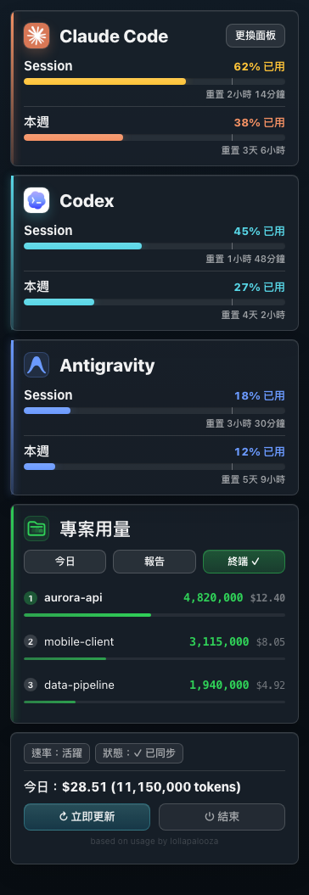
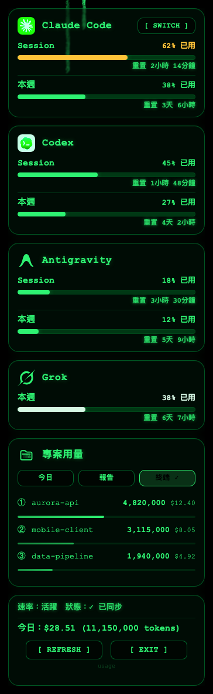
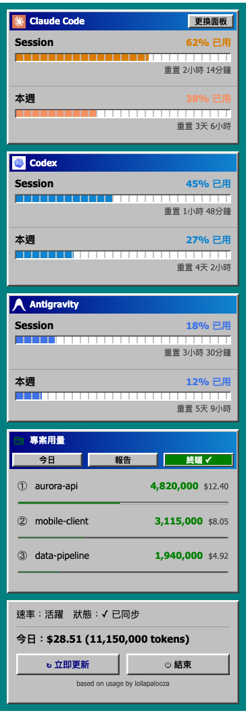
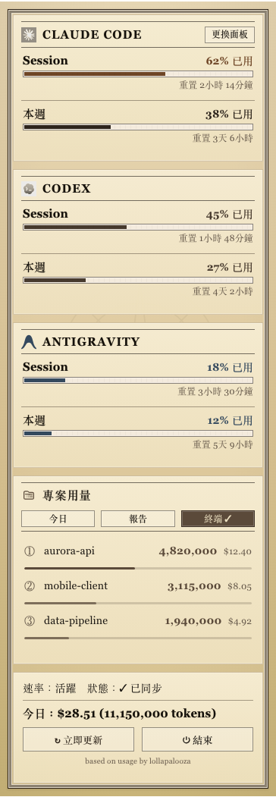
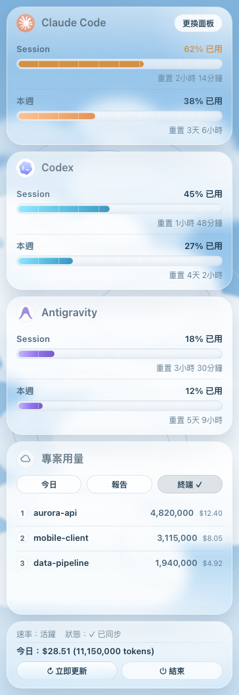
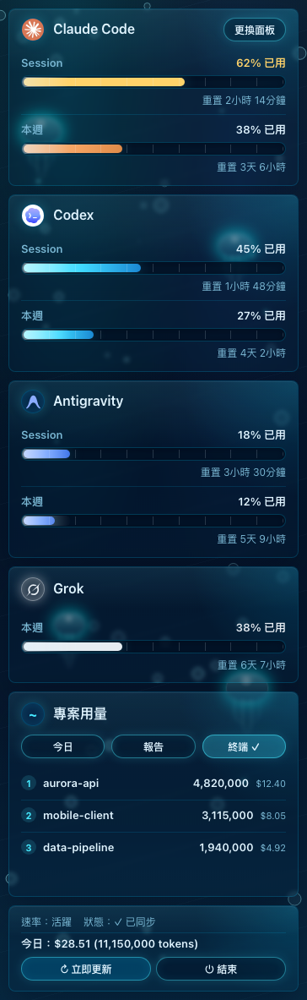
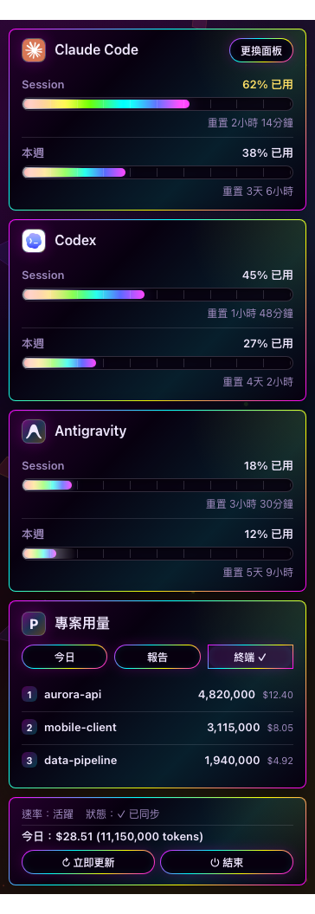
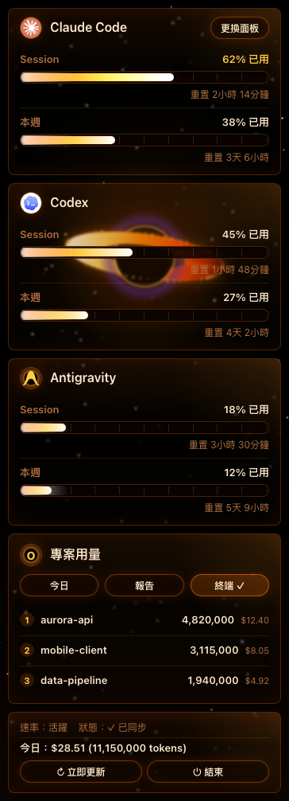
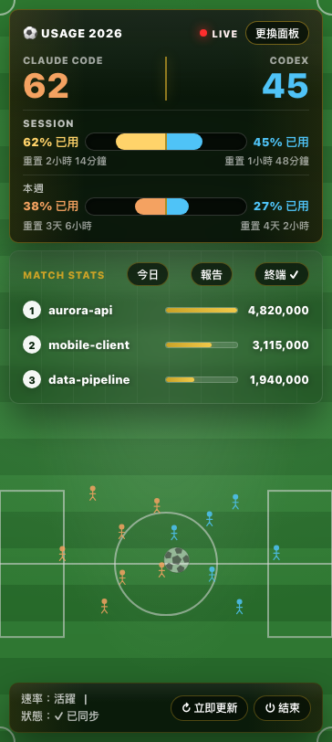
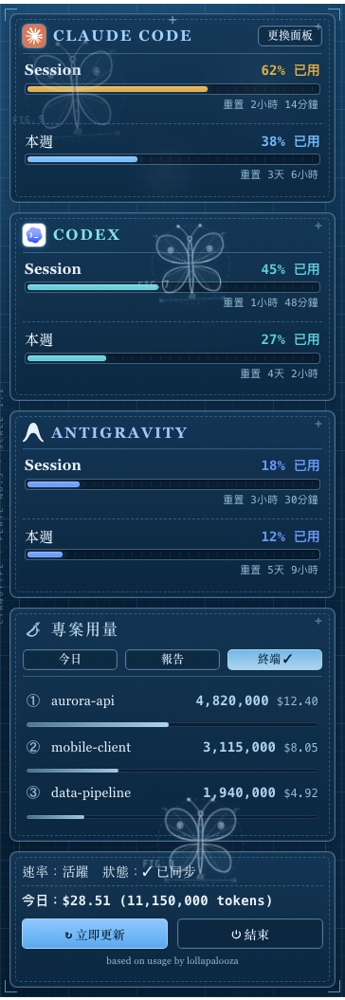

<p align="center">
  
</p>

# usage

### 把 Claude Code、Codex 與 Antigravity 額度直接放進 macOS 選單列與 Windows 系統匣

長時間重構或除錯若依賴 Claude Code，無預警撞到額度上限代價很高。`usage` 讓你在撞牆前就先看到 5 小時與每週限額，並且全程留在畫面上——不用停下來跑指令、也不用另外開頁面，答案就在你本來就在看的地方。

繁體中文 · [简体中文](README.zh-CN.md) · [English](README.md) · [日本語](README.ja.md) · [한국어](README.ko.md) &nbsp;|&nbsp; [Discussions](https://github.com/aqua5230/usage/discussions) &nbsp;|&nbsp; [官方介紹頁](https://aqua5230.github.io/usage/)

[](https://github.com/aqua5230/usage/stargazers)
[](https://github.com/aqua5230/usage/actions/workflows/check.yml)
[](https://github.com/aqua5230/usage/releases/latest)
[](https://www.python.org/)
[](https://github.com/aqua5230/usage/releases/latest)
[](LICENSE)
[](https://www.bestpractices.dev/projects/13538)

<p align="center">
  
</p>

Claude Code 與 Codex 的數字是被動讀自你機器上原本就在寫的紀錄檔，因此**看額度這件事永遠不會呼叫 Anthropic 或 OpenAI 的 LLM API**，也不會消耗你的任何 token。Antigravity 是唯一的例外：它的額度來自 Google 官方額度端點，用的是 Antigravity CLI 本來就存在本機的登入身分——這只是一次元資料查詢，同樣不會消耗你的模型額度。

## 快速上手

```bash
brew install --cask aqua5230/usage/usage
```

安裝後會自動進入「應用程式」資料夾。先右鍵**「打開」**一次讓 Gatekeeper 放行，再點選單列圖示即可。想直接下載，或想看完整設定流程？見下方 [安裝](#安裝)。

**快速跳轉：** [你會得到什麼](#你會得到什麼) · [隱私與資料來源](#隱私與資料來源) · [環境需求](#環境需求) · [安裝](#安裝) · [Windows 支援](#windows-支援) · [主題展示](#主題展示) · [常見問題排查](#常見問題排查) · [跟其他工具比較](#跟其他工具比較) · [不適合誰](#不適合誰) · [開發](#開發)

## 你會得到什麼

### 即時可見性

- **常駐監控：** 額度常駐選單列，顏色標示警戒級別（綠到紅）。點開能看 Session、Weekly 與各專案用量細節。
- **Antigravity 支援：** Antigravity（Gemini）的 Session 與每週額度以第三張卡片出現在除了 World Cup 2026 以外的每一款面板（該款維持兩隊對戰 HUD）。數字直接向官方額度 API 查詢，用的是 Antigravity CLI 本來就存在你機器上的登入身分——每幾分鐘自動刷新，重置倒數即時遞減。
- **服務狀態警示：** Claude Code、Claude API 或 Codex API 發生故障或效能降級時，相關面板底部會顯示橘紅警示橫幅，數字只讀官方公開的 Statuspage.io 狀態頁——絕不呼叫 LLM 用量 API。Antigravity 因沒有可用的公開狀態頁，暫不支援。
- **上下文提醒與系統通知：** Context Window 達 70% 時，狀態列會提醒你 `/clear` 或 `/compact` 來避免浪費；也可自選開啟系統通知，在接近門檻或額度恢復時提醒。
- **獨立隱藏區塊：** 沒有全部都用？一鍵就能把 Claude Code、Codex 或 Antigravity 從選單列及面板上徹底隱藏。

### 工作流程輔助

- **進度管家 (Progress Concierge)：** 開新對話時，自動把你上次的請求、未提交的變更與待辦清單交給 AI，不用重講一遍進度。完全本機、預設關閉。
- **省 token 模式 (Token Saver)：** 一鍵讓 Claude Code 與 Codex 講話更精簡，省下輸出 token，但程式碼與錯誤訊息保證一個字都不縮水。輕聲提醒維持精簡，長對話也不走鐘——在真實 Session 的 A/B 測試中，對話後段回覆維持少約 40%，而不是走鐘變長 84%。
- **終端機整合：** `usage status --json` 把 Claude Code 與 Codex 的配額交給任何能執行指令的工具——Starship、tmux，或你自己的腳本。讀的是選單列本來就在讀的本機檔案，不做網路呼叫。[現成的設定片段](docs/DEVELOPMENT.zh-TW.md)。
- **Token 浪費健檢：** 每日背景診斷重複讀取檔案、污染目錄與雜訊輸出。當發現浪費時會有一行提示，AI 也能帶你看懂問題並給出改善建議。

### AI 協作

- **AI 人才市場：** 將整個 AI 團隊帶進 Claude Code。瀏覽並一鍵將精選 subagent persona 安裝到 `~/.claude/agents/`，全程透過內建 CLI 在本機完成。
- **AI 圓桌討論：** 開一個獨立視窗，讓 Claude Code、Codex、Antigravity 進行多輪討論——自選參與者、模型與辯論風格，開始前就看得到大約會花多少 token。可以在輪間插話引導方向，共識計票看得出誰不同意，並讓討論在全體同意時提早收尾。位子可以戴上 AI 人才市場的專家角色，也能附上唯讀資料夾讓參與者參考真實檔案。
- **AI 更新日報：** 開啟每天自動更新的公開[網頁](https://aqua5230.github.io/ai-updates/)，涵蓋 Claude Code、Codex、Antigravity 三套工具、保留完整歷史。已審核的更新顯示五語白話版，未審核的顯示官方原文。

### 報告與洞察

- **深度 HTML 報告：** 視覺化呈現每日與每週趨勢、專案排行與成本，包含帶有貢獻熱力圖與 Wrapped 摘要的 Year in Review。「最近在做什麼」一區列出 Claude Code 為你近期對話取的名字，讓數字有脈絡可對。一鍵另存 .html／.csv／.png 分享，全程離線、可選擇隱藏專案名稱，這些標題也一併遮蔽。

### 體驗與客製化

- **13 款視覺面板：** 可在 Classic、Matrix、Windows 95、Newspaper、Cloud Observation、Midnight Aquarium、Prism Arcade、Black Hole、World Cup 2026、Lepidoptera（藍曬圖）、彩繪玻璃、摺紙與 Catppuccin（官方配色，四款 flavor 全支援）之間切換。
- **面板自由擺放：** 面板不再釘在選單列圖示下方。在任何空白處按住就能拖到你想要的位置，下次打開還在原地。點到別的 App 也不會消失，要再點一次選單列圖示或按 Esc 才關。
- **拖曳排序：** 按住任何一張額度卡上下拖曳就能交換順序，排法在所有包含額度卡的主題間共用（除 World Cup 2026 之外），重開也會記住。
- **神獸夥伴：** 百分比旁常駐一隻小型白色動畫神獸（Claude 是鳳凰，Codex 是飛龍，Antigravity 是獅子），各自跟著自家工具的 token 燃燒率動態加速。
- **自動多語言 (i18n)：** 介面支援繁中、簡中、英、日、韓，自動跟隨系統語言設定。

## 隱私與資料來源

- Claude Code 與 Codex 的數字**只讀本機紀錄檔**；讀取這些數字**不會呼叫 Anthropic 或 OpenAI 的 LLM API**。
- Antigravity 額度需要連網，而且只有你真的使用它才會發生：額度是用 Antigravity CLI 登入後存下的 OAuth 憑證，向 Google 官方額度端點查詢——依 CLI 版本不同，這個憑證讀自 macOS Keychain、Windows 認證管理員，或本機 token 檔。`usage` 只讀取這個憑證而不寫回，任何刷新後的 access token 也只留在記憶體中；這個呼叫本身只讀額度資訊，絕不消耗你的模型額度。
- 背景連網範圍：上述 Antigravity 額度／token 端點、用來標示故障的 Claude 與 Codex 公開狀態頁、估算成本用的公開價格表（斷網會用內建預設），以及偶爾檢查 GitHub 版本更新。Claude Code 與 Codex 的紀錄檔內容不會被上傳。

## 環境需求

- macOS 12（Monterey）或更新版本，或 Windows 10/11
- 已經使用過 Claude Code、Codex 或 Antigravity（需有本機用量資料）
- （僅限從原始碼跑）Python 3.13

## 安裝

### 1. Homebrew（推薦）

安裝後，未來只需 `brew upgrade --cask usage` 即可自動更新。

```bash
brew install --cask aqua5230/usage/usage
```

*（第一次開啟：請在 Finder 找到 `usage.app` 按右鍵 → **打開** 讓系統放行）。*

### 2. 下載 macOS App

1. 到 [GitHub Releases 頁面](https://github.com/aqua5230/usage/releases/latest) 下載最新的 `usage.app.zip`。
2. 解壓縮，將 `usage.app` 拖進「應用程式」資料夾。
3. 第一次開啟：在 Finder 對 `usage.app` 按右鍵 → **打開** → 確認打開。

## Windows 支援

Windows 可完整使用核心功能：系統匣 UI、Claude Code 狀態列 hook 與 Codex 記錄解析都原生支援。從[最新 GitHub Release](https://github.com/aqua5230/usage/releases/latest)下載 `usage-windows.zip`，解壓後執行 `usage.exe` 即可，無須安裝程式。系統匣 UI 需要 Microsoft Edge WebView2 Runtime；Windows 10 與 11 通常已內建。

系統匣圖示會隨 Claude 額度百分比更新；提示文字摘要 Claude 與 Codex 的各視窗。左鍵會用 WebView2 開啟與 macOS 相同的 13 款主題面板（Classic 加另外十二款）；右鍵只有「重設面板位置」與「結束」；面板切換、重新整理、開機自啟與檢查更新都在面板選單。

Windows 的差異：面板開在工作區右下角，而非貼齊系統匣圖示；更新提示使用系統 Yes/No 對話框；AI 人才市場與 AI 圓桌討論面板僅提供 macOS。

### 程式碼簽章政策

Free code signing provided by [SignPath.io](https://about.signpath.io/), certificate by [SignPath Foundation](https://signpath.org/).

團隊角色：

- 提交者與審查者：[aqua5230](https://github.com/aqua5230)
- 批准者：[aqua5230](https://github.com/aqua5230)

隱私權政策：除非使用者或安裝、操作此程式的人員明確要求，否則本程式不會將任何資訊傳輸至其他網路系統。關於 `usage` 替你發出的網路呼叫及如何避免，請參閱[隱私與資料來源](#隱私與資料來源)。

### 首次打開：設定狀態列

如果你用過 Codex，它會自動讀到資料。若是 Claude Code，請點選單彈窗內的**「設定狀態列 (Set Up Status Line)」**按鈕來安裝同步 hook。
完成後請重開相關工具（將 Claude Code 用 Cmd+Q 完全結束後重開）。

同一顆按鈕在你裝了 Antigravity CLI 時，也會一併幫它設定狀態列；沒裝的話什麼都不會寫入。你自己在那邊設定過的狀態列會先備份起來，關掉開關時還原。

設定完成後，Claude Code 視窗底部會出現這樣的狀態列：

<p align="center">
  
</p>

## 主題展示

內建 **13 款可切換的視覺主題**，可直接在 UI 中切換：

<p align="center">
  
  
  
  
  
  
  
  
  
  
</p>

## 常見問題排查

如果顯示 `--` 先別急，絕大多數情況只是還沒有本機資料。

| 症狀 | 原因 | 解法 |
|------|------|------|
| menu bar 顯示 `--` | 尚無資料或 hook 未更新 | 先跑一次 Codex。若為 Claude Code，點擊「設定狀態列」（原始碼安裝則跑 `python3 main.py --setup`） |
| 執行 `usage.app` 裡的 `main.py` 出現 `ImportError` | 打包版的 `main.py` 要用 app 內建的直譯器，無法手動執行 | 別跑那份。改點 app 裡的「設定狀態列」，或 clone 原始碼從原始碼執行 |
| 不小心按到「結束」 | 程式已終止 | 透過 Spotlight 或應用程式重新開啟 `usage.app`。（`launchctl start com.lollapalooza.usage` 只在你開啟過「開機自啟」時才有作用。） |
| 顯示「N 分鐘未更新」 | Claude Code 未執行 | 打開 Claude Code 跑一下就會更新 |
| Codex 區塊空白 | 找不到 Codex 紀錄 | 用 Codex 跑一次對話 |
| 今日花費是 $0.00 | 價格表對不上或抓取失敗 | 刪掉 `~/.usage/pricing_cache.json` 重新抓取，或檢查 `USAGE_DEBUG=1` |
| Antigravity 卡片沒出現 | 未安裝或未登入 Antigravity CLI | 安裝並登入 Antigravity CLI，背景額度查詢成功後卡片會自動出現 |
| App 打不開 | Gatekeeper 擋住 | Finder → 找到 `usage.app` → 按右鍵 → 打開 |

## 跟其他工具比較

| 功能 | usage | ccusage | TokenTracker |
|------|:-----:|:-------:|:------------:|
| 一直在螢幕上 | ✅ | — | ✅ |
| macOS 選單列 | ✅ | — | ✅ |
| Claude Code 與 Codex 支援 | ✅ | 僅 Claude | ✅ |
| Antigravity（Gemini）支援 | ✅ | — | — |
| Claude Code 與 Codex 服務狀態警示 | ✅ | — | — |
| HTML 深度報告與 UI 面板 | ✅ | ✅ | — |
| AI 人才市場 | 僅 macOS | — | — |
| AI 圓桌討論 | 僅 macOS | — | — |
| AI 更新日報 | ✅ | — | — |
| 進度管家與省 token 模式 | ✅ | — | — |
| Token 浪費健檢 | ✅ | — | — |
| 讀取額度時不呼叫 LLM API | ✅ | ✅ | ✅ |
| 開源授權 | AGPL-3.0 | MIT | — |

## 不適合誰

- 你完全生活在終端機裡，不想要任何背景執行的選單列圖示——單次執行的 CLI 工具會更適合你。
- 你沒有在使用 Claude Code、Codex 或 Antigravity——因為這樣 `usage` 就沒有可以讀取的本機用量資料。
- 你使用的是 Linux——目前只支援 macOS 與 Windows。

## 開發

從原始碼建置、設定自訂 agent 或執行終端機 TUI？請參閱 **[開發文件 (docs/DEVELOPMENT.zh-TW.md)](docs/DEVELOPMENT.zh-TW.md)**。

## 授權

採用 AGPL-3.0-only（見 [LICENSE](LICENSE)）。若 fork 或發佈衍生版本，請標注原作者與專案連結：
https://github.com/aqua5230/usage
