<p align="center">
  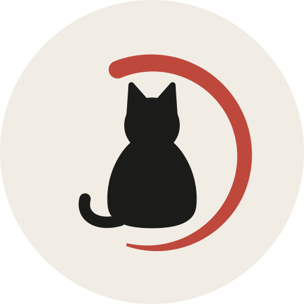
</p>

# usage

### Claude Code、Codex、Antigravity、Grok CLIのクォータを、いつでも画面に。

`usage` は5時間と週ごとの上限を macOS のメニューバーや Windows のシステムトレイに表示し、緑から赤への色で示します。長いリファクタリングの途中で上限に達して残量不足に気づくのは、痛いものです。これなら事前に把握できます。コマンドを実行する必要も、ページを開く必要もありません。

[繁體中文](README.zh-TW.md) · [简体中文](README.zh-CN.md) · [English](../README.md) · 日本語 · [한국어](README.ko.md) &nbsp;|&nbsp; [Discussions](https://github.com/aqua5230/usage/discussions) &nbsp;|&nbsp; [公式サイト](https://aqua5230.github.io/usage/)

[](https://github.com/aqua5230/usage/stargazers)
[](https://github.com/aqua5230/usage/actions/workflows/check.yml)
[](https://github.com/aqua5230/usage/releases/latest)
[](https://pypi.org/project/usage-cli/)
[](https://www.python.org/)
[](https://github.com/aqua5230/usage/releases/latest)
[](../LICENSE)
[](https://www.bestpractices.dev/projects/13538)

<p align="center">
  
</p>

Claude CodeとCodexの数値はマシン上にある既存のログファイルから読み取ります。Antigravity のクォータは、Antigravity CLI がローカルに保存しているサインイン情報を使って Google の公式クォータエンドポイントから取得されます。

`usage` は消費を抑えるのにも役立ちます。コンテキストウィンドウが膨らんだり prompt cache が冷えたりする前に、ステータスラインが先にお知らせします。Token セーバーのトグルで回答も短く保てます。実際のセッションでの A/B テストでは、後半の回答が 84% 長くなることはなく、約 40% 短いまま維持されました。

## クイックスタート

```bash
brew install --cask aqua5230/usage/usage
```

Applicationsフォルダに自動でインストールされます。一度開いてみて、macOS 15 以降でブロックされたら「システム設定」→「プライバシーとセキュリティ」を開き、下へスクロールして**「このまま開く」**をクリック。macOS 14 以前では一度右クリックして **「開く」** を選び、Gatekeeperを通します。その後メニューバーのアイコンをクリックしてください。直接ダウンロードしたい場合や、設定の全手順を確認したい場合は、下の[インストール](#インストール)をご覧ください。

**macOSではない場合は** `uvx usage-cli` でどのOSでもターミナルインターフェースを開けます。Linuxも対応、インストール不要、メニューバーはありません。

**クイックジャンプ：** [主な機能](#主な機能) · [プライバシーとデータソース](#プライバシーとデータソース) · [必要環境](#必要環境) · [インストール](#インストール) · [ステータスライン設定](#初回起動ステータスラインを設定) · [Claude Code サイドパネル](#claude-code-サイドパネル) · [Windows対応](#windows対応) · [テーマギャラリー](#テーマギャラリー) · [トラブルシューティング](#トラブルシューティング) · [比較](#比較) · [対象外となるケース](#対象外となるケース) · [開発](#開発)

## 主な機能

### 常時可視化

- **常時表示モニター：** クォータをメニューバーに常時表示し、緑から赤への色分けで示します。セッション、週ごと、プロジェクトごとの詳細を見たいときはクリックしてください。
- **Antigravityサポート：** Antigravity（Gemini）のセッションと週ごとのクォータが、World Cup 2026 を除くすべてのパネルで3枚目のカードとして表示されます（World Cup 2026 は2チームの HUD のままです）。数値は、Antigravity CLIがすでにあなたのマシンに保存しているサインイン情報を使って公式クォータAPIから直接取得します。数分ごとに自動更新され、リセットまでのカウントダウンもリアルタイムに減っていきます。Antigravityには独立した2つのクォータがあります。カードは既定でGeminiを表示し、タイトル横の「Gemini ⇄」タグをタップするとClaude / GPTに切り替わり、選択は記憶されます。
- **Grok CLIサポート：** 4枚目のカードがGrok CLI自身のローカルデバッグログから直接週ごとのクレジット割合を読み取ります。Grok CLIはセッションやバーンレートのデータを公開していないため、カードには1本の週間バーのみが表示されますが、リクエストごとのtoken使用量はClaude CodeやCodexと同様に今日のコストやプロジェクト合計にカウントされます。
- **Muse Codeの利用額：** Muse Codeのリクエストごとのトークンと費用が、今日の費用、プロジェクト合計、HTMLレポート、`usage` CLIに反映されます。データはMuse自身がローカルに保存するセッションログから読み取ります。Museにはローカルのクォータデータがないため、Museのクォータカードはありません。
- **サービスステータスアラート：** Claude Code、Claude API、またはCodex APIで障害やパフォーマンス低下が発生した場合、関連パネルの底部にオレンジ赤色の警告バナーが表示されます。数値は公式の公開Statuspage.ioページから読み取られます。Antigravityは公開ステータスページがないため対象外です。
- **コンテキストの通知と通知センター：** コンテキストウィンドウが70%（埋まるのが速い場合はもっと早く）に達すると、ステータスラインが `/clear` または `/compact` を促し、tokenの無駄を防ぎます。クォータ上限と回復についてのシステム通知を受け取ることもできます。
- **キャッシュの健康状態：** ステータスラインにはClaude Codeの prompt cache ヒット率が表示されます。キャッシュが外れてから10分間は、その理由（モデルの変更、ツールの変更、5分以上の放置など）も表示されるので、余計にかかったトークンが自分の操作によるものかどうかがわかります。ヒット率にはClaude Code 2.1.251以降、理由の表示には2.1.260以降が必要です。古いバージョンではこれらは表示されません。
- **セクションを隠す：** 一部のツールしか使わない場合は、ワンクリックでClaude Code、Codex、Grok CLI、またはAntigravityのセクションをメニューバーとパネルから完全に隠せます。

### ワークフロー支援

- **進捗コンシェルジュ：** 新しいClaude Codeセッションを開くと、`usage` は前回のリクエスト、未コミットの変更、未完了のtodoを含む最後の進捗をそのままAIに渡します。`/resume` も振り返りも不要です。キャッシュが切れるほど放置した会話を `/resume` で再開すると、次のメッセージで再送信されるトークン数を知らせ、先に `/compact` するよう勧めます。デフォルトではオフです。
- **Token セーバー：** メニューバーのトグルで、Claude CodeとCodexにセッション中はより簡潔で平易な言葉で応答するよう求めます。コードとエラーメッセージはバイト単位でそのままに、出力tokenを節約します。メッセージごとの控えめなリマインダーにより、長い会話でも回答が冗長に戻るのを防ぎます——実際のセッションでのA/Bテストでは、会話後半の回答も約40%短い状態を維持し、84%長くなるような冗長化は起きませんでした。
- **Claude Code サイドパネル（macOS／Windows）：** Claude Code 内で使用量、会話、バックグラウンド作業を確認。 [サイドパネルの紹介](#claude-code-サイドパネル).
- **初心者モード（macOS）：** 初期設定はオフ。Claude Code の回答のあと、その回答から専門用語を最大 3 つ選び、UI と同じ言語で一行のやさしい説明を付けて入力欄の上に表示します。9 を押すと「わかった」になります。スキップした用語は 1 日、3 日、7 日後にまた出てきます。わかった用語は 7 日、21 日、60 日後に一問の選択式クイズとして出題されます。クイズは 1 日 1 問までで、間違えるとその用語はヒントに戻ります。`/terms` で用語の履歴を開けます。用語選びは Claude Code 経由で Claude Haiku に頼むため、Claude のクォータを少し使います。5 時間クォータが 90% 以上のあいだは自動で止まります。
- **クォータ認識モード（macOS）：** 初期設定はオフ。5 時間クォータが 80%、90%、95% を超えたとき、または週クォータが 95% を超えたとき、Claude Code に残量とリセット時刻を一行で伝えます。すると Claude は大きな作業を始める前にそれを知らせ、小さな作業を先にやるかリセットを待つかを選ばせてくれます。Claude Code、Codex、Antigravity のクォータが対象で、各段階は一つの会話で一度だけ伝えます。追加のモデル呼び出しはありません。
- **5 時間セッションを自動開始：** デフォルトはオフです。オンにすると、5 時間枠がリセットされた直後に `usage` が各ツールへごく小さなメッセージを 1 通ずつ自動送信し（Claude は Haiku、Antigravity は Gemini 3.5 Flash Low、Codex は最も低コストなモデル）、次の 5 時間のカウントをすぐに開始します。このメッセージはわずかに枠を消費しますが、無視できる程度です。普段の使用量の確認ではメッセージを送りません。送るのはこのスイッチをオンにしたときだけです。
- **ターミナル統合：** `usage status --json` は、コマンドを実行できるあらゆるツール——Starship、tmux、または独自のスクリプト——に Claude Code、Codex、Antigravity、Grok のクオータを渡します。メニューバーと同じローカルファイルを読み込みます。[既製のスニペット](DEVELOPMENT.md#quota-status-for-other-tools-usage-status)。
- **Token浪費ヘルスチェック：** 毎日のバックグラウンド診断がログをスキャンし、ファイルの繰り返し読み込み、汚染ディレクトリ、冗長なBash出力などの無駄を検出します。問題が見つかると一行の通知を表示します。「show me」と言えば、AIが修正手順を案内します。

### 最新動向の把握

- **AI更新日報：** 毎日更新される公開[ウェブページ](https://aqua5230.github.io/ai-updates/)を開き、Claude Code、Codex、Antigravityを網羅し、完全な履歴を保持します。審査済みの更新は5言語の平易な要約を、未審査のものは公式原文を表示します。

### レポートとインサイト

- **詳細HTMLレポート：** 日次・週次のtoken推移、プロジェクトランキング、コストを示す共有可能なHTML詳細レポートです。コントリビューションヒートマップおよび「Wrapped」サマリーを含むYear in Reviewを搭載しています。「最近の作業」セクションには、Claude Codeが直近の会話に付けた名前が並ぶため、数値を文脈とともに読めます。.html、.csv、または.pngとしてエクスポートでき、完全オフラインで、プロジェクト名のマスキングも任意で可能です（これらのタイトルも一緒に隠れます）。

### 体験とカスタマイズ

- **16種類のビジュアルテーマ：** デフォルト（Default）、Matrix、Windows 95、レトロ新聞（Newspaper）、Cloud Observation、Midnight Aquarium、Prism Arcade、Black Hole、World Cup 2026、蝶の図鑑（Lepidoptera）、渡り鳥（Migration）、ステンドグラス、折り紙、手描きノート（Sketchbook）、心電図モニター（Heart Monitor）、Catppuccin（公式パレット、4種のflavorすべてに対応）を含むパネルスタイルを切り替えられます。
- **パネルを自由に配置：** 空白部分をドラッグして好きな場所に移動でき、次回開いたときもその位置を保持します。他のアプリにフォーカスが移っても消えず、メニューバーアイコンをもう一度クリックするかEscキーを押すと閉じます。
- **ドラッグで並べ替え：** 任意のクォータカードをつかんで上下にドラッグすると順序を入れ替えられます。並び順はクォータカードを含むすべてのテーマ（World Cup 2026 を除く）で共有され、再起動後も維持されます。
- **自動ローカライズ：** UIテキストは繁体字中国語、簡体字中国語、英語、日本語、韓国語で利用でき、システム設定に自動的に合わせます。

## プライバシーとデータソース

Claude デスクトップのチャット利用枠にも対応します。Claude Code CLI の追加インストールやステータスライン設定は不要です。デスクトップを開いたままにすると、Claude Code の利用枠ファイルがない場合にローカルの `plan-usage-history.json` を読み取ります（Windows の Microsoft Store 版も対応）。ローカルのChromiumブロック形式HTTPキャッシュに新しい応答があり、組織が一致する場合は、セッションと週間の正確なリセット時刻も読み取ります。新しいキャッシュを履歴のサンプリングより優先し、古いキャッシュは割合が一致する場合だけ使用します。キャッシュがない、形式が未対応、古い、またはデータが一致しない場合は時刻を不明とし、推測しません。通常5～15分ごとに更新され、パネルにデータの経過時間を表示します。30分を超えると古いデータと表示し、2時間を超えると非表示にします。最新の組織の記録を使用し、カスタムプロファイルは検索しません。Cookie、ログイントークン、API呼び出しは不要です。これらの利用枠キャッシュにプロジェクト別のトークン数はありません。デスクトップのセッションが `~/.claude/projects/` に互換性のある Claude Code ログも書き込む場合、既存のプロジェクト・トークンレポートで集計されます。

- Claude CodeとCodexの数値は、マシン上のローカルログファイルから読み取られます。
- Antigravityのクォータにはネットワーク接続が必要で、実際に使用している場合のみ発生します：クォータは、Antigravity CLIがサインイン後に保存したOAuth資格情報を使ってGoogleの公式クォータエンドポイントに問い合わせて取得します——CLIのバージョンにより、macOSのキーチェーン、Windowsの資格情報マネージャー、またはローカルのtokenファイルから読み取られます。`usage` はその資格情報を読み取るだけで書き戻さず、更新されたaccess tokenもメモリ内にのみ保持します。この呼び出し自体はクォータ情報を読み取ります。
- バックグラウンドのネットワーク通信は、上記のAntigravityクォータ／tokenエンドポイント、障害を知らせるためのClaudeとCodexの公開ステータスページ、コスト見積もり用の公開モデル価格表の取得（オフライン時は内蔵価格にフォールバック）、およびときどき行われるGitHubでの新バージョン確認です。Claude CodeとCodexのログ内容がアップロードされることはありません。
- 初心者モードはオンにしたときだけ通信します。あなた自身の Claude Code のログインを使い、Claude Code の最新の回答を Claude Haiku に送って用語を選びます。用語の履歴は `~/.usage/glossary.json` に保存されます。

## 必要環境

- macOS 12（Monterey）以降、または Windows 10/11
- Claude Code、Codex、Antigravity、Grok CLI のローカル使用データ、または利用枠履歴を生成する実行中の Claude デスクトップ。
- （ソースから実行する場合のみ）Python 3.13。

## インストール

### 1. Homebrew（推奨）

Homebrew経由でインストールすると、`brew upgrade --cask usage` 一回で最新の状態に保てます。

```bash
brew install --cask aqua5230/usage/usage
```

*（初回起動：macOS 15 以降では「システム設定」→「プライバシーとセキュリティ」を開き、下へスクロールして**「このまま開く」**をクリック。macOS 14 以前ではFinderで `usage.app` を右クリック → **「開く」** を選び、Gatekeeperを通します）。*

### 2. macOS版Appをダウンロード

1. [GitHub Releasesページ](https://github.com/aqua5230/usage/releases/latest)から最新の `usage.app.zip` をダウンロードします。
2. 展開し、`usage.app` をApplicationsフォルダにドラッグします。
3. 初回起動：macOS 15 以降では「システム設定」→「プライバシーとセキュリティ」を開き、下へスクロールして**「このまま開く」**をクリック。macOS 14 以前ではFinderで `usage.app` を右クリック → **「開く」** → 開くを確認します。

### 3. uvx（ゼロインストール、全OS対応）

`uvx usage-cli` を実行すると、ターミナルインターフェースを直接開けます。uvがPython 3.13を自動的に用意するため、別途Pythonをインストールする必要はありません。

コマンドを常設したい場合は `uv tool install usage-cli` を実行し、以降は `usage` を使います（例：`usage status --json`）。このインストール方法ではCLIのみが提供され、メニューバーAppは含まれません。

Linuxでも `usage setup` でClaude Codeのステータスラインをインストールでき、macOSやWindowsと同じようにプロンプトの下にクォータが表示されます。CIがUbuntuでこの経路を検証しています。メニューバーとシステムトレイのAppは引き続きmacOSとWindows専用です。

## 初回起動：ステータスラインを設定

Codexを使用したことがある場合、`usage` はその履歴を自動で取得します。Claude Codeの場合は、アプリのポップオーバーで **「Set Up Status Line」** ボタンをクリックし、同期hookをインストールしてください。
その後、該当するツールを再起動します（macOS では Claude Code を Cmd+Q で完全に終了してから再度開き、Windows ではターミナルを再起動するか新しいセッションを開始します）。

同じボタンで、Antigravity CLI と Grok CLI がインストールされている場合はそれらのステータスラインも一緒に設定されます。インストールされていない場合は何も書き込まれません。ご自身で設定したステータスラインは事前にバックアップされ、スイッチをオフにした際に復元されます。

設定が完了すると、Claude Codeウィンドウ下部に次のようなステータスラインが表示されます。

<p align="center">
  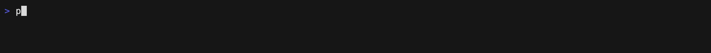
</p>

## Claude Code サイドパネル

Claude Code を離れずに、使用量、他の会話、バックグラウンド作業を確認できます。macOS・Windows 対応。

<p align="center">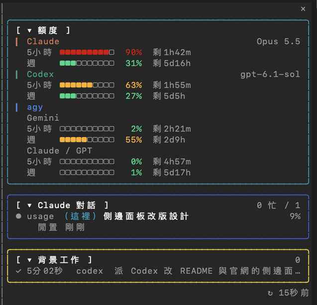</p>

**表示されるもの**

- **使用量：** 5時間と週間の上限。
- **Claude の会話：** 権限の確認や MCP への入力を待つ会話は黄色で表示されます。
- **バックグラウンド作業：** Claude が Agent ツールで起動したサブエージェントと、その状態も表示します。

**有効にする手順**

1. usage のメニューバーメニュー（macOS）またはシステムトレイのパネルメニュー（Windows）で **Claude Code サイドパネル** にチェックを入れます。macOS では **Claude Code** サブメニューの **サイドペイン** です。
2. 新しい会話を開くか `/reload-plugins` を実行します。
3. ターミナル幅が144列以上なら右側に自動で開きます。狭い場合は `/usage-dash` を入力します。

<details>
<summary>互換性と更新</summary>

- mod 対応の新しい Claude Code が必要です。2.1.289 で確認済みです。
- パネルが右側に表示されるのは Claude Code のフルスクリーン表示のときだけで、それ以外は入力欄の上に表示されます。Windows 版ではパネルを有効にするとフルスクリーン表示も有効になり、パネルをオフにすると元に戻ります。
- macOS 標準の Terminal は256色のみ対応し、灰色の背景が出る場合があります。`/config` で ANSI ダークテーマを選んでください。
- usage アプリの起動時に、有効なパネルをアプリ内のバージョンへ自動更新します。

</details>

## Windows対応

Windowsでも主要機能をすべてネイティブで利用できます。システムトレイUI、Claude Codeのステータスラインhook、Codex履歴の解析に対応しています。[最新のGitHub Release](https://github.com/aqua5230/usage/releases/latest)から`usage-windows.zip`をダウンロードし、展開して`usage.exe`を実行してください。インストールは不要です。初回起動時にSmartScreenの**「WindowsによってPCが保護されました」**が表示されたら、**「詳細情報」**→**「実行」**をクリックします。システムトレイUIにはMicrosoft Edge WebView2 Runtimeが必要ですが、通常はWindows 10/11に含まれています。

システムトレイのアイコンにはClaudeまたはCodexのセッションクォータの残量がパーセントで表示されます。右クリックメニューまたはパネルメニューの **トレイの表示元 → Claude Code / Codex** で切り替えると、即座に反映され、再起動後も保持されます（初期値：Claude）。Codexにセッション枠がない場合は週間クォータを使用し、ツールチップにもその枠を表示します。データがない場合は `--` を表示します。ツールチップには両方の概要を表示し、選択した表示元を先頭にします。左クリックでWebView2上にmacOSと同じ16種類のテーマパネル（デフォルトと他の15テーマ）を開きます。右クリックには「パネルの位置をリセット」と「終了」もあり、パネル切替、更新、ログイン時に起動、更新確認はパネル側のメニューにあります。

メニューで **タスクバーにクォータを表示** を有効にすると、通知領域の左側に透明な `Codex: 92%` ラベルを表示します。タスクバーの位置、画面倍率、明暗テーマに追従し、全画面表示やタスクバーの自動非表示時には隠れます。クリックするとパネルが開きます。ボタンの空き領域が足りない場合はタスクバーの外側に移動します。通常のアプリアイコンはメニュー用に残り、ラベルは選択した表示元とクォータ期間に連動します。

Windowsでの相違点：パネルはトレイアイコンの隣ではなく作業領域の右下に開きます。更新通知はシステムのYes/Noダイアログです。

### コード署名ポリシー

Free code signing provided by [SignPath.io](https://about.signpath.io/), certificate by [SignPath Foundation](https://signpath.org/).

チームの役割：

- コミッターおよびレビュアー：[aqua5230](https://github.com/aqua5230)
- 承認者：[aqua5230](https://github.com/aqua5230)

プライバシーポリシー：本プログラムは、ユーザーまたはプログラムをインストールもしくは操作する人が明確に要求しない限り、他のネットワークシステムにいかなる情報も転送しません。`usage` があなたの代わりに行うネットワーク呼び出しと、それを避ける方法については、[プライバシーとデータソース](#プライバシーとデータソース)をご覧ください。

## テーマギャラリー

UIから直接 **16種類のビジュアルテーマ**を切り替えられます。

<p align="center">
  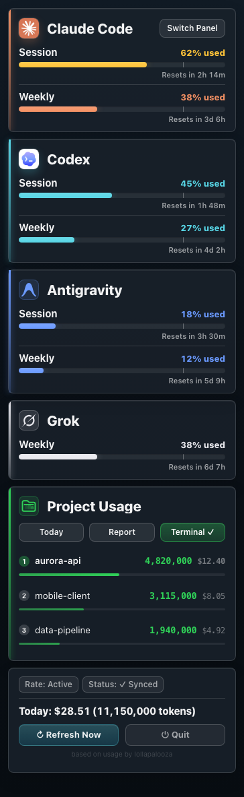
  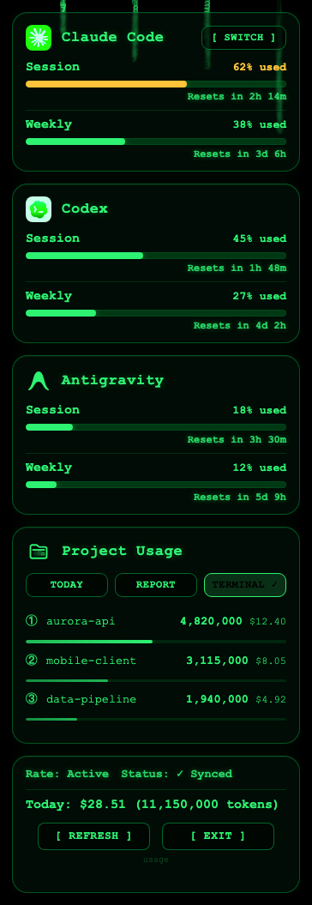
  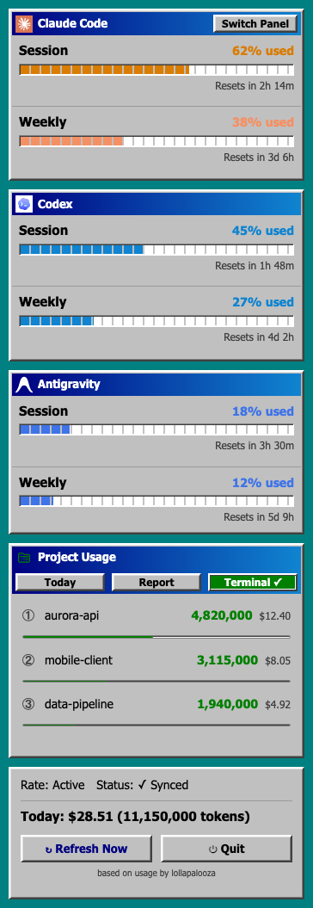
  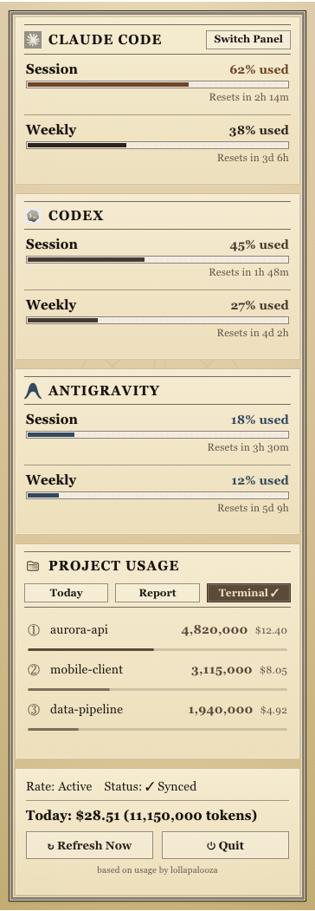
  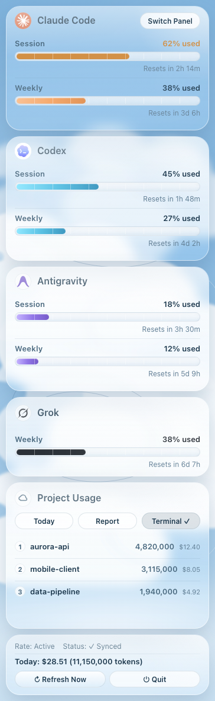
  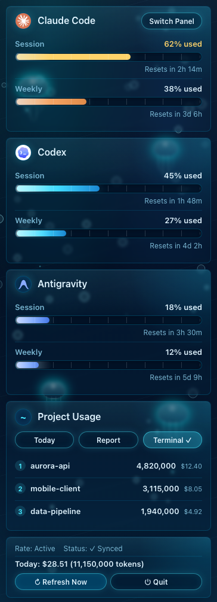
  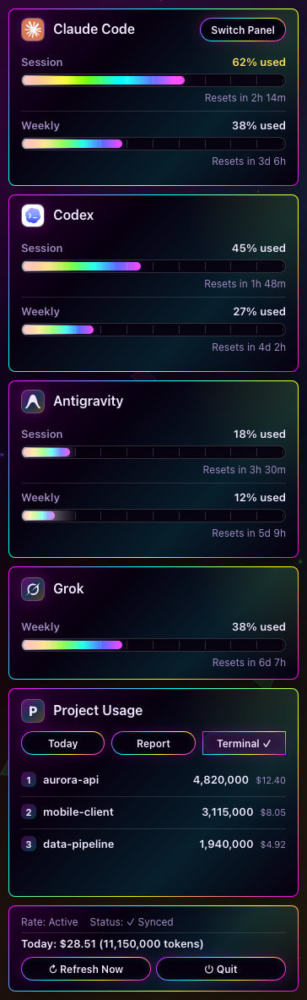
  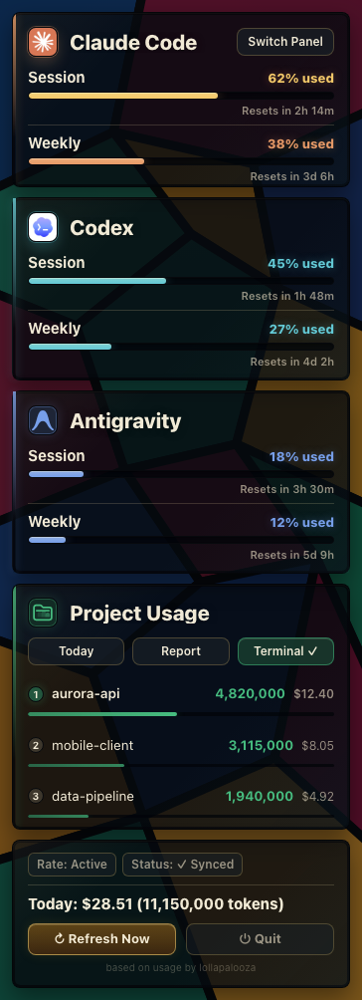
  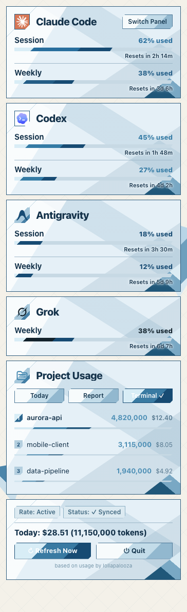
  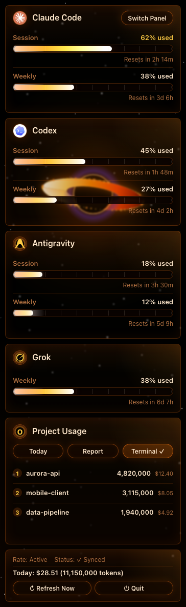
  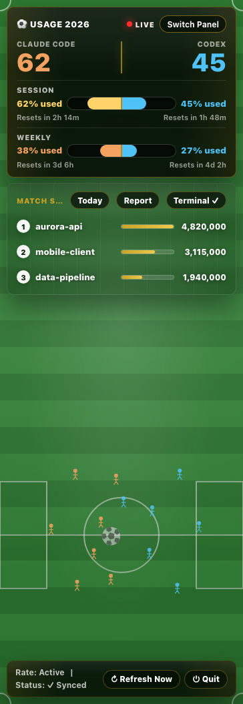
  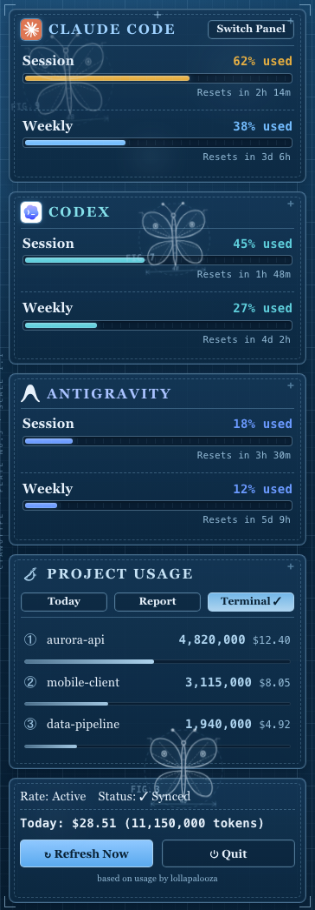
  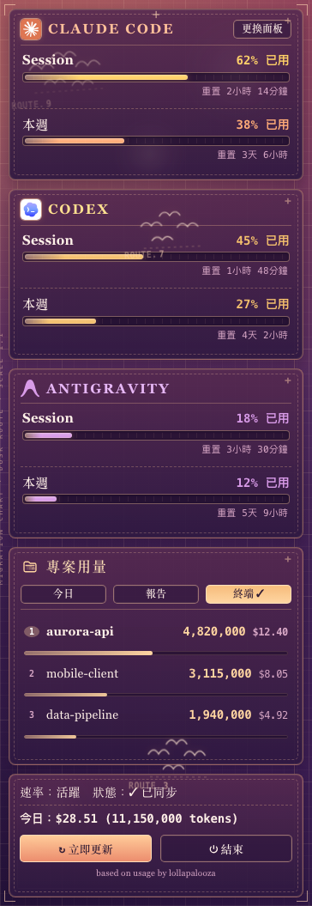
  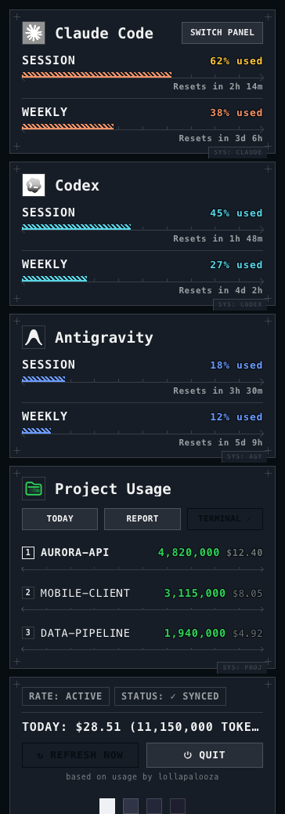
  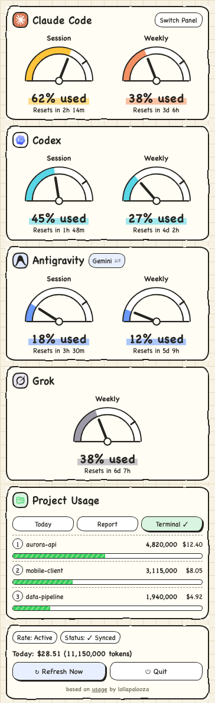
  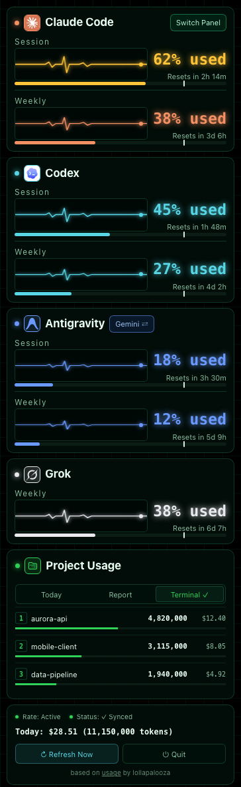
</p>

## トラブルシューティング

メニューバーに `--` と表示される場合、通常は故障ではなく、まだローカルデータがないだけです。

| 症状 | 考えられる原因 | 対処法 |
|---------|--------------|-----|
| メニューバーに `--` と表示される | データがまだない、またはClaude Code hookが更新されていない | Codexで会話を一度実行します。Claude Codeでは「ステータスラインを設定」をクリックします（ソースから実行する場合は `python3 main.py --setup`） |
| `usage.app` 内の `main.py` を実行すると `ImportError` | バンドル版の `main.py` はアプリ内蔵のインタプリタが必要で、手動では実行できません | そのファイルは実行しないでください。アプリの「ステータスラインを設定」をクリックするか、リポジトリを clone してソースから実行します |
| 誤って「Quit」を選んだ | プロセスが終了した | SpotlightまたはApplicationsから `usage.app` を再起動してください（`launchctl start com.lollapalooza.usage` はログイン時に起動を有効にしている場合のみ機能します）。 |
| 状態が「N minutes stale」と表示される | Claude Codeが実行されていない | Claude Codeを開いて実行したままにします |
| Codexセクションが空 | Codex履歴が見つからない | Codexで会話を実行してログを生成します |
| 今日のコストが$0.00と表示される | モデル価格情報がない | `~/.usage/pricing_cache.json` を削除するか、`USAGE_DEBUG=1` を確認します |
| Antigravityカードが表示されない | Antigravity CLIがインストールされていない、またはサインインしていない | Antigravity CLIをインストールしてサインインします。バックグラウンドのクォータ取得が成功すると、カードが自動的に表示されます |
| Appが開かない | macOS Gatekeeperにブロックされた | macOS 15 以降：「システム設定」→「プライバシーとセキュリティ」→ 下へスクロール → このまま開く。macOS 14 以前：Finderで `usage.app` を右クリック → 開く |
| Windowsで「WindowsによってPCが保護されました」と表示される | SmartScreenがまだこのダウンロードを認識していない | 「詳細情報」→「実行」をクリック |

## 比較

| 機能 | usage | ccusage | TokenTracker |
|---------|:-----:|:-------:|:------------:|
| 常に画面表示 | ✅ | — | ✅ |
| macOSメニューバーとWindowsシステムトレイ | ✅ | — | macOS専用 |
| Claude CodeとCodexの使用量 | ✅ | Claudeのみ | ✅ |
| Antigravityの使用量（GeminiとClaude / GPT） | ✅ | — | — |
| Grok CLIの使用量 | ✅ | — | — |
| Muse Codeのトークン利用額 | ✅ | — | — |
| Claude CodeとCodexのサービスステータスアラート | ✅ | — | — |
| HTML詳細レポートとUI | ✅ | ✅ | — |
| AI更新日報 | ✅ | — | — |
| 進捗コンシェルジュとToken セーバー | ✅ | — | — |
| Token浪費ヘルスチェック | ✅ | — | — |
| Claude Code 初心者モードとクォータ認識モード | ✅ | — | — |
| オープンソースライセンス | AGPL-3.0 | MIT | — |

## 対象外となるケース

- ターミナルでのみ作業しており、バックグラウンドでメニューバーアイコンを実行したくない場合——単発で確認できる CLI ツールのほうが適しています。
- Claude Code、Codex、Antigravity、Grok CLI のいずれも使用していない場合——`usage` が読み取るためのローカル使用量データが存在しません。
- Linux でメニューバーを使いたい場合。現在メニューバーがあるのは macOS と Windows のみですが、ターミナルインターフェース（`uvx usage-cli`）なら Linux でも動作します。

## 開発

ソースからのビルド、カスタムエージェントの設定、またはターミナルTUIの実行については、**[開発ドキュメント](DEVELOPMENT.md)**をご覧ください。

## ライセンス

AGPL-3.0-onlyの下でライセンスされています（[LICENSE](../LICENSE)を参照）。フォークまたは変更版を再配布する場合は、原作者を明記し、次へのリンクを付けてください。
https://github.com/aqua5230/usage
