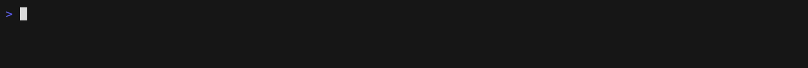

<p align="center">
  
</p>

# usage

### Claude Code, Codex, Antigravity, Grok CLI 할당량이 언제나 화면에.

`usage`는 5시간 및 주간 한도를 macOS 메뉴 막대나 Windows 시스템 트레이에 녹색부터 빨간색까지의 색상으로 표시합니다. 긴 리팩터링 도중에 한도에 부딪혀서야 잔여량이 부족했다는 걸 알게 되는 건 난감한 일입니다. 이제 미리 확인할 수 있습니다. 실행할 명령도, 열 페이지도 없습니다.

[繁體中文](README.zh-TW.md) · [简体中文](README.zh-CN.md) · [English](../README.md) · [日本語](README.ja.md) · 한국어 &nbsp;|&nbsp; [Discussions](https://github.com/aqua5230/usage/discussions) &nbsp;|&nbsp; [공식 사이트](https://aqua5230.github.io/usage/)

[](https://github.com/aqua5230/usage/stargazers)
[](https://github.com/aqua5230/usage/actions/workflows/check.yml)
[](https://github.com/aqua5230/usage/releases/latest)
[](https://pypi.org/project/usage-cli/)
[](https://www.python.org/)
[](https://github.com/aqua5230/usage/releases/latest)
[](../LICENSE)
[](https://www.bestpractices.dev/projects/13538)

<p align="center">
  
</p>

- **모든 할당량을 한눈에:** Claude Code, Codex, Antigravity의 세션 및 주간 한도와 리셋 카운트다운, 그리고 Grok CLI의 주간 크레딧.
- **컴퓨터에 이미 있는 데이터 읽기:** Claude Code, Codex, Grok CLI 수치는 로컬 로그에서 가져옵니다. Antigravity 할당량은 CLI가 이미 저장해 둔 로그인 정보를 사용해 Google 공식 엔드포인트에서 가져옵니다.
- **token이 낭비되기 전에 경고:** Claude Code 상태 줄이 컨텍스트 창 비대화와 식은 prompt cache를 미리 알립니다. 배너는 Claude 또는 Codex의 장애를 표시합니다.
- **Claude Code 내부 도우미:** 사이드 패널, 더 간결한 답변, 새 세션을 위한 진행 상황 인계, 할당량 인식 계획. 모두 선택 사항입니다.
- **보고서와 16가지 테마:** token 추세와 비용을 보여주는 HTML 보고서, 그리고 선택할 수 있는 16가지 패널 테마.

## 설치

macOS 12 이상 및 Windows 10/11에서 실행됩니다.

**macOS, Homebrew(권장):**

```bash
brew install --cask aqua5230/usage/usage
```

Applications 폴더에 설치되며, `brew upgrade --cask usage`로 최신 상태를 유지할 수 있습니다. 직접 다운로드하고 싶으신가요? [최신 릴리스](https://github.com/aqua5230/usage/releases/latest)에서 `usage.app.zip`을 받아 압축을 풀고 `usage.app`을 Applications 폴더로 드래그하세요.

**macOS 첫 실행:** macOS 15 이상에서 차단되면 시스템 설정 → 개인정보 보호 및 보안을 열고 아래로 스크롤한 뒤 **그래도 열기**를 클릭하세요. macOS 14 이하에서는 Finder에서 `usage.app`을 마우스 오른쪽 버튼으로 클릭 → **열기**를 한 번 실행하세요. 그다음 메뉴 막대 아이콘을 클릭하세요.

**Windows:** [최신 릴리스](https://github.com/aqua5230/usage/releases/latest)에서 `usage-windows.zip`을 다운로드하고 압축을 풀어 `usage.exe`를 실행하세요. 설치는 필요하지 않습니다. SmartScreen에 **Windows의 PC 보호**가 표시되면 **추가 정보** → **실행**을 클릭하세요. [Windows 지원](#windows-지원)을 참고하세요.

**터미널 전용, 모든 OS(Linux 포함):** `uvx usage-cli`는 설치 없이 바로 터미널 인터페이스를 엽니다. uv가 Python 3.13을 자동으로 준비합니다. `usage` 명령을 계속 사용하려면 `uv tool install usage-cli`를 실행하세요. Linux에서는 `usage setup`으로 Claude Code 상태 줄도 설치할 수 있습니다. 이 경로에는 메뉴 막대나 트레이 앱이 없습니다.

`usage`는 Claude Code, Codex, Antigravity, Grok CLI 중 적어도 하나 또는 실행 중인 Claude 데스크톱 앱의 데이터가 필요합니다.

## 첫 실행: 상태 줄 설정

Codex를 사용한 적이 있다면 `usage`가 기록을 자동으로 가져옵니다. Claude Code의 경우 앱 팝오버에서 **"Set Up Status Line"** 버튼을 클릭하여 동기화 hook을 설치하세요.
그런 다음 해당 도구를 다시 시작하세요(macOS에서는 Claude Code를 Cmd+Q로 완전히 종료한 뒤 다시 열고, Windows에서는 터미널을 다시 시작하거나 새 세션을 시작합니다).

동일한 버튼은 Antigravity CLI와 Grok CLI가 설치되어 있을 때 해당 상태 줄도 함께 설정하며, 설치되어 있지 않으면 아무것도 기록하지 않습니다. 직접 설정해 둔 상태 줄은 먼저 백업되며 스위치를 끌 때 복원됩니다.

설정이 완료되면 Claude Code 창 하단에 다음과 같은 상태 줄이 표시됩니다.

<p align="center">
  
</p>

## 제공 기능

### 화면 표시

- **메뉴 막대 모니터:** 할당량이 녹색부터 빨간색까지 색상으로 구분됩니다. 전체 세션, 주간, 프로젝트별 내역이 필요하면 클릭하세요.
- **Antigravity 카드:** 기본적으로 Gemini 풀을 표시합니다. `Gemini ⇄` 태그를 누르면 별도의 Claude / GPT 풀로 전환되며 선택이 기억됩니다.
- **Grok CLI 카드:** Grok CLI 로컬 디버그 로그에서 읽어온 주간 크레딧 비율입니다. 해당 token 역시 비용과 프로젝트 총계에 반영됩니다.
- **Muse Code 사용 금액:** 토큰과 비용이 오늘 비용, 프로젝트 합계, 보고서, CLI에 반영됩니다. Muse에는 로컬 할당량 데이터가 없으므로 카드는 없습니다.
- **서비스 장애 경고:** Claude Code, Claude API 또는 Codex API에 장애나 성능 저하가 발생하면 공개 상태 페이지에서 읽어온 주황색/빨간색 경고 배너가 표시됩니다.
- **컨텍스트 및 캐시 경고:** 컨텍스트 창이 지나치게 커지기 전에 상태 줄이 `/clear` 또는 `/compact`를 안내하고, prompt cache가 빗나간 이유를 알려 줍니다.
- **사용하지 않는 항목 숨기기:** 클릭 한 번으로 Claude Code, Codex, Grok CLI 또는 Antigravity 섹션을 메뉴 막대와 패널에서 숨길 수 있습니다.

### Claude Code 내부

- **진행 상황 컨시어지:** 새 세션을 열면 마지막 요청, 커밋하지 않은 변경 사항, 미완료 todo가 이미 AI에 전달된 상태로 시작됩니다. `/resume`도, 요약도 필요 없습니다. 기본값은 꺼짐입니다.
- **Token 절약기:** 코드와 오류 메시지는 바이트 단위로 그대로 유지하면서 Claude Code와 Codex에 더 간결하고 쉬운 말로 답하도록 요청합니다. 실제 세션의 A/B 테스트에서 대화 후반 답변은 84% 길어지는 대신 약 40% 더 짧게 유지되었습니다.
- **사이드 패널:** 작업 화면 옆에서 할당량, 다른 대화, 백그라운드 작업을 확인하세요. [사이드 패널 소개](#claude-code-사이드-패널).
- **초보자 모드:** 각 답변에서 최대 3개의 전문 용어를 골라 쉬운 한 줄 설명으로 풀어주고, 나중에 복습할 수 있도록 다시 보여줍니다. 기본값은 꺼짐이며 Claude 할당량을 조금 씁니다.
- **할당량 인식 모드:** 할당량이 부족해지면, 이를 소진할 수 있는 큰 작업을 시작하기 전에 Claude가 미리 알려주어 작은 작업을 먼저 하거나 재설정을 기다릴 수 있게 합니다. 기본값은 꺼짐이며 모델을 따로 호출하지 않습니다.
- **5시간 세션 자동 시작:** 5시간 할당량이 리셋된 직후 각 도구에 아주 작은 메시지를 하나씩 보내 다음 창이 바로 카운트되도록 합니다. 기본값은 꺼짐입니다.
- **Token 낭비 상태 점검:** 반복되는 파일 읽기와 불필요한 출력을 찾기 위해 로그를 매일 검사합니다. AI에게 "show me"라고 말하면 해결 방법을 안내합니다.

### 보고서 및 기타

- **HTML 보고서:** 일간 및 주간 token 추세, 프로젝트 순위, 비용, 기여 히트맵이 포함된 Year in Review를 제공합니다. 완전히 오프라인에서 .html, .csv 또는 .png로 내보낼 수 있으며 프로젝트 이름 마스킹도 지원합니다.
- **터미널 통합:** `usage status --json`은 Claude Code, Codex, Antigravity, Grok 할당량을 Starship, tmux 또는 자체 스크립트에 전달합니다. [미리 준비된 스니펫](DEVELOPMENT.md#quota-status-for-other-tools-usage-status).
- **AI 업데이트 일보:** 매일 공개되는 [웹 페이지](https://aqua5230.github.io/ai-updates/)에서 Claude Code, Codex, Antigravity의 변경 사항을 5개 언어의 알기 쉬운 요약으로 제공합니다.
- **자유로운 레이아웃:** 패널을 원하는 위치로 드래그하고, 할당량 카드를 드래그해 순서를 바꾸며, 16가지 테마를 전환할 수 있습니다. UI는 시스템 언어(번체 중국어, 간체 중국어, 영어, 일본어, 한국어)를 따릅니다.

<details>
<summary>임계값, 버전 및 세부 사항</summary>

- **컨텍스트 색상:** 컨텍스트 수치는 50% 또는 200K 토큰에서 노란색, 80% 또는 400K 토큰에서 빨간색으로 바뀌며 먼저 도달한 기준을 적용합니다. 알림은 70%(빠르게 채워지면 더 일찍)에 나타납니다. 색이 바뀌면 상태 줄에 이미지 수와 파일 및 명령 출력의 추정 비율이 표시됩니다.
- **Prompt cache:** 적중률은 Claude Code 2.1.251 이상이 필요합니다. 캐시가 빗나간 뒤 10분 동안은 상태 줄에 그 이유(모델 변경, 도구 변경, 5분 이상 유휴 등)가 표시되며, 이는 2.1.260 이상이 필요합니다. 구버전에서는 이러한 부분이 표시되지 않습니다.
- **알림:** 할당량 한도와 복구에 관한 시스템 알림을 선택해 받을 수 있습니다.
- **Antigravity 카드:** 몇 분마다 새로고침됩니다. World Cup 2026을 제외한 모든 테마에 표시됩니다(World Cup 2026은 양 팀 HUD로 유지됨).
- **서비스 장애 경고:** Antigravity는 공개 상태 페이지가 없으므로 지원되지 않습니다.
- **Token 낭비 상태 점검:** 오염 디렉터리와 장황한 Bash 출력도 감지합니다.
- **Linux:** CI가 Ubuntu에서 `usage setup`을 검증합니다.
- **진행 상황 컨시어지:** 캐시가 만료될 만큼 오래 둔 대화를 `/resume`으로 다시 열면 다음 메시지에서 다시 보낼 토큰 수를 알려 주고 먼저 `/compact`를 권합니다.
- **초보자 모드(macOS/Windows):** 전문 용어가 UI 언어로 입력창 위에 표시됩니다. 9를 누르면 "이해함"으로 표시됩니다. 건너뛴 용어는 1일, 3일, 7일 뒤에 다시 나옵니다. 이해한 용어는 7일, 21일, 60일 뒤에 객관식 한 문제로 다시 나오며(하루 최대 한 문제), 틀리면 그 용어는 다시 힌트로 돌아갑니다. `/terms`로 용어 기록을 열 수 있습니다. 용어 고르기는 Claude Code를 통해 Claude Haiku에 맡기며, 5시간 할당량이 90% 이상이면 자동으로 멈춥니다.
- **할당량 인식 모드(macOS/Windows):** 5시간 할당량이 80%, 90%, 95%를 넘거나 주간 할당량이 95%를 넘으면, Claude Code에 남은 양과 재설정 시각을 한 줄로 알려 줍니다. Claude Code, Codex, Antigravity를 모두 지원하며, 각 단계는 한 대화에서 한 번만 알리고, 각 할당량과 모델 그룹을 별도로 처리하므로 소진된 할당량은 해당 모델에서 실행되는 작업에만 영향을 줍니다.
- **5시간 세션 자동 시작:** Claude는 Haiku, Antigravity는 Gemini 3.8 Flash Low, Codex는 가장 저렴한 모델을 사용합니다. 소모되는 할당량은 무시할 수 있는 수준입니다. 평소 사용량을 확인할 때는 메시지를 보내지 않으며, 이 스위치를 켰을 때만 보냅니다.
- **패널:** 다른 앱으로 포커스가 이동해도 사라지지 않으며, 메뉴 막대 아이콘을 다시 클릭하거나 Esc 키를 눌러야 닫힙니다. 카드 순서는 할당량 카드가 있는 모든 테마(World Cup 2026 제외)에서 공유되며 다시 시작해도 유지됩니다.
- **HTML 보고서:** "최근 작업" 섹션에는 Claude Code가 최근 대화에 붙인 이름이 나열되며, 마스킹 기능은 이 제목들도 함께 가려줍니다.
- **AI 업데이트 일보:** 미심사 항목은 공식 원문을 보여줍니다. 전체 기록이 보존됩니다.
- **업데이트 후 변경 내용:** 업데이트 후 처음 실행할 때 이번 버전의 변경 내용을 UI 언어로 한 번만 표시합니다. 새로 설치한 경우에는 표시하지 않습니다.

</details>

## Claude Code 사이드 패널

Claude Code를 떠나지 않고 사용량, 다른 대화, 백그라운드 작업을 확인하세요. macOS와 Windows에서 사용할 수 있습니다.

<p align="center"></p>

**표시되는 내용**

- **사용량:** 5시간 및 주간 한도.
- **Claude 대화:** 권한 확인이나 MCP 입력을 기다리는 대화는 노란색으로 표시됩니다.
- **대화 알림:** 다른 Claude 대화가 끝나거나 내 입력을 기다리기 시작하면 프로젝트 이름으로 시작하는 알림이 뜹니다.
- **최신 답변:** 각 대화 행의 두 번째 줄에 최신 답변이 표시됩니다.
- **백그라운드 작업:** Claude가 Agent 도구로 시작한 하위 에이전트와 상태도 표시됩니다.

**켜는 방법**

1. usage 메뉴 막대 메뉴(macOS) 또는 시스템 트레이 메뉴(Windows)의 **Claude Code** 하위 메뉴에서 **사이드 패널**을 체크하세요.
2. 새 대화를 열거나 `/reload-plugins`를 실행하세요.
3. 터미널 너비가 144열 이상이면 오른쪽에 자동으로 열립니다. 좁으면 `/usage-dash`를 입력하세요.

<details>
<summary>호환성과 업데이트</summary>

- mod를 지원하는 최신 Claude Code가 필요합니다. 2.1.289에서 확인했습니다.
- 패널은 Claude Code의 전체 화면 레이아웃에서만 오른쪽에 표시되고, 그 외에는 입력창 위에 표시됩니다. Windows 버전은 패널을 켜면 전체 화면 레이아웃도 함께 켜고, 패널을 끄면 원래대로 돌립니다.
- macOS 기본 Terminal은 256색만 지원하여 회색 배경이 나타날 수 있습니다. `/config`에서 ANSI 어두운 테마를 선택하세요.
- usage 앱을 시작하면 켜져 있는 패널을 앱에 포함된 버전으로 자동 업데이트합니다.

</details>

## 개인정보 보호와 데이터 소스

- **로컬 로그:** Claude Code, Codex, Grok CLI, Muse Code 수치는 컴퓨터의 로컬 로그 파일에서 읽습니다. 그 내용은 절대 업로드되지 않습니다.
- **Claude Desktop:** Claude Code CLI나 상태 줄이 없어도 Claude 데스크톱을 열어 두면 `usage`가 로컬 플랜 사용 기록을 읽습니다. 쿠키, 로그인 토큰, API 호출이 필요하지 않습니다. 재설정 시간은 로컬 캐시에서 확인될 때만 표시되며 결코 추정하지 않습니다.
- **Antigravity**는 실제로 사용하는 경우에만 네트워크 연결이 필요합니다: 할당량은 Antigravity CLI가 로그인 후 저장한 OAuth 자격 증명으로 Google의 공식 할당량 엔드포인트에 조회해 가져옵니다——CLI 버전에 따라 macOS 키체인, Windows 자격 증명 관리자, 또는 로컬 token 파일에서 읽습니다. `usage`는 그 자격 증명을 다시 쓰지 않으며, 갱신된 access token도 메모리에만 보관합니다. 이 호출 자체는 할당량 메타데이터를 읽습니다.
- **기타 백그라운드 네트워크 활동:** 장애를 알리기 위한 Claude와 Codex의 공개 상태 페이지, 비용 추정을 위한 공개 모델 가격표(오프라인에서는 내장 가격 사용), 그리고 가끔 GitHub에서 새 버전을 확인하는 작업입니다.
- **초보자 모드**는 켰을 때만 네트워크를 사용합니다: 본인의 Claude Code 로그인으로 Claude Code의 최신 답변을 Claude Haiku에 보내 용어를 고릅니다. 용어 목록은 `~/.usage/glossary.json`에 보관됩니다.

<details>
<summary>Claude Desktop 할당량을 읽는 방법</summary>

Claude Code 한도 파일이 없을 때 `usage`는 Claude Desktop의 로컬 `plan-usage-history.json`을 읽습니다(Windows Microsoft Store 설치 포함). 로컬 Chromium 블록 파일 HTTP 캐시에 최신 응답이 있고 조직이 일치하면 `usage`는 정확한 세션 및 주간 재설정 시간도 읽습니다. 최신 캐시를 지연된 기록보다 우선하며 이전 캐시는 비율이 일치해야 합니다. 캐시가 없거나 형식 미지원, 만료 또는 데이터 불일치이면 카운트다운을 알 수 없음으로 유지합니다.

데스크톱 샘플은 보통 5~15분마다 갱신됩니다. 패널에 데이터 경과 시간을 표시하며, 30분 이후에는 오래된 데이터로 표시하고 2시간 이후에는 표시하지 않습니다. 가장 최근 조직 기록을 사용하며 사용자 지정 프로필은 검색하지 않습니다. 이 한도 캐시에는 프로젝트별 토큰 수가 없습니다. 데스크톱 세션이 `~/.claude/projects/`에 호환되는 Claude Code 로그도 기록하면 기존 프로젝트 및 토큰 보고서에 집계됩니다.

</details>

## Windows 지원

Windows에서도 핵심 기능을 모두 네이티브로 사용할 수 있습니다: macOS와 동일한 16가지 테마를 갖춘 시스템 트레이 UI, Claude Code 상태 줄 hook, Codex 기록 분석이 모두 네이티브로 작동합니다. 시스템 트레이 UI에는 Microsoft Edge WebView2 Runtime이 필요하며, 보통 Windows 10과 11에 이미 포함되어 있습니다.

<details>
<summary>트레이 아이콘, 작업 표시줄 라벨 및 기타 차이점</summary>

시스템 트레이 아이콘은 Claude 또는 Codex의 남은 세션 할당량을 백분율로 표시합니다. 오른쪽 클릭 메뉴나 패널 메뉴에서 **트레이 표시 소스 → Claude Code / Codex**를 선택하면 즉시 반영되고 재시작 후에도 유지됩니다(기본값: Claude). Codex에 세션 한도가 없으면 주간 할당량을 사용하며 도구 설명에 해당 기간을 표시합니다. 할당량 데이터가 없으면 `--`로 표시합니다. 도구 설명에는 두 도구의 각 창 요약을 표시하며 선택한 소스를 먼저 보여줍니다. 왼쪽 클릭하면 WebView2에서 할당량 테마를 엽니다. 오른쪽 클릭 메뉴에는 '패널 위치 재설정'과 '종료'도 있으며 패널 전환, 새로 고침, 로그인 시 실행, 업데이트 확인은 패널 메뉴에 있습니다.

메뉴에서 **작업 표시줄 할당량 표시**를 켜면 알림 영역 왼쪽에 투명한 `Codex: 92%` 라벨이 표시됩니다. 작업 표시줄 위치, 화면 배율, 밝고 어두운 테마에 맞춰 표시되며 전체 화면이나 작업 표시줄 자동 숨김 시에는 숨겨집니다. 클릭하면 패널이 열립니다. 버튼 공간이 부족하면 작업 표시줄 바깥으로 이동합니다. 일반 앱 아이콘은 메뉴 진입점으로 유지되며 라벨은 선택한 소스와 할당량 기간을 따릅니다. 라벨을 오른쪽 클릭하면 트레이 아이콘과 같은 메뉴가 열립니다.

패널은 트레이 아이콘 옆이 아니라 작업 영역 오른쪽 아래에 열리며, 업데이트 알림은 시스템 Yes/No 대화 상자를 사용합니다.

</details>

### 코드 서명 정책

Free code signing provided by [SignPath.io](https://about.signpath.io/), certificate by [SignPath Foundation](https://signpath.org/).

팀 역할:

- 커미터 및 리뷰어: [aqua5230](https://github.com/aqua5230)
- 승인자: [aqua5230](https://github.com/aqua5230)

개인정보 처리방침: 본 프로그램은 사용자나 설치 또는 조작하는 사람의 명시적인 요청이 없는 한, 어떤 정보도 다른 네트워크 시스템으로 전송하지 않습니다. `usage`가 귀하를 대신하여 수행하는 네트워크 호출 및 이를 피하는 방법에 대해서는 [개인정보 보호와 데이터 소스](#개인정보-보호와-데이터-소스)를 참조하세요.

## 테마 갤러리

UI에서 직접 **16가지 시각 테마**를 전환하세요.

<p align="center">
  
  
  
  
</p>

<details>
<summary>다른 12가지 테마 보기</summary>

<p align="center">
  
  
  
  
  
  
  
  
  
  
  
  
</p>

</details>

## 문제 해결

메뉴 막대에 `--`가 표시되면 대개 고장이 아니라 아직 로컬 데이터가 없다는 뜻입니다.

| 증상 | 가능한 원인 | 해결 방법 |
|---------|--------------|-----|
| 메뉴 막대에 `--` 표시 | 아직 데이터가 없거나 Claude Code hook이 갱신되지 않음 | Codex 대화를 한 번 실행하세요. Claude Code는 "상태 표시줄 설정"을 클릭하세요(소스에서 실행할 때는 `python3 main.py --setup`) |
| `usage.app` 안의 `main.py` 실행 시 `ImportError` | 번들에 포함된 `main.py`는 앱 내장 인터프리터가 필요해 직접 실행할 수 없음 | 그 파일은 실행하지 마세요. 앱에서 "상태 표시줄 설정"을 클릭하거나, 저장소를 clone해 소스에서 실행하세요 |
| 실수로 "Quit" 선택 | 프로세스가 종료됨 | Spotlight 또는 Applications에서 `usage.app`을 다시 실행하세요. (`launchctl start com.lollapalooza.usage`는 로그인 시 실행을 켜둔 경우에만 작동합니다.) |
| 상태에 "N minutes stale" 표시 | Claude Code가 실행 중이 아님 | Claude Code를 열고 실행 상태로 두세요 |
| Codex 섹션이 비어 있음 | Codex 기록을 찾지 못함 | Codex 대화를 실행하여 로그를 생성하세요 |
| 오늘 비용이 $0.00으로 표시 | 모델 가격 정보 없음 | `~/.usage/pricing_cache.json`을 삭제하거나 `USAGE_DEBUG=1`을 확인하세요 |
| Antigravity 카드가 표시되지 않음 | Antigravity CLI가 설치되지 않았거나 로그인되지 않음 | Antigravity CLI를 설치하고 로그인하세요. 백그라운드 할당량 조회가 성공하면 카드가 자동으로 나타납니다 |
| App이 열리지 않음 | macOS Gatekeeper가 차단함 | [macOS 첫 실행](#설치)을 참고하세요 |
| Windows에 "Windows의 PC 보호"가 표시됨 | SmartScreen이 아직 이 다운로드를 인식하지 못함 | 추가 정보 → 실행 클릭 |

## 비교

| 기능 | usage | ccusage | TokenTracker |
|---------|:-----:|:-------:|:------------:|
| 화면에 항상 표시 | ✅ | — | ✅ |
| macOS 메뉴 막대 및 Windows 시스템 트레이 | ✅ | — | macOS 전용 |
| Claude Code 및 Codex 사용량 | ✅ | ✅ | ✅ |
| Antigravity 사용량(Gemini 및 Claude / GPT) | ✅ | — | — |
| Grok CLI 사용량 | ✅ | — | — |
| Muse Code 토큰 사용 금액 | ✅ | — | — |
| Claude Code 및 Codex 서비스 상태 경고 | ✅ | — | — |
| HTML 심층 보고서 및 UI | ✅ | ✅ | — |
| Claude Code 도우미(Token 절약기, 진행 상황 컨시어지, 초보자 및 할당량 인식 모드, 상태 점검) | ✅ | — | — |
| AI 업데이트 일보 | ✅ | — | — |
| 오픈 소스 라이선스 | AGPL-3.0 | MIT | — |

## 적합하지 않은 경우

- 항상 터미널에서 작업하며 백그라운드에 메뉴 막대 아이콘을 띄워두고 싶지 않은 경우 — 단일 실행 CLI 도구가 더 적합합니다.
- Claude Code, Codex, Antigravity, Grok CLI 또는 Claude 데스크톱을 사용하지 않는 경우 — `usage`가 읽어올 사용량 데이터가 없기 때문입니다.
- Linux에서 메뉴 막대를 쓰려는 경우. 현재 메뉴 막대는 macOS와 Windows에만 있지만, 터미널 인터페이스(`uvx usage-cli`)는 Linux에서도 실행됩니다.

## 개발

소스에서 빌드, 사용자 지정 에이전트 구성 또는 터미널 TUI 실행 방법은 **[개발 문서](DEVELOPMENT.md)**를 확인하세요.

## 라이선스

AGPL-3.0-only로 라이선스됩니다([LICENSE](../LICENSE) 참고). 수정한 버전을 fork하거나 재배포하는 경우, 원저자를 표기하고 다음 링크를 포함해 주세요.
https://github.com/aqua5230/usage
