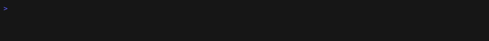

<p align="center">
  
</p>

# usage

### 你的 Claude Code、Codex、Antigravity 和 Grok CLI 配额，一直都在屏幕上。

`usage` 把 5 小时和每周限额放在 macOS 菜单栏或 Windows 系统托盘中，用绿到红的颜色表示。重构做到一半才发现配额用完，很难受；现在你会提前看到。不用跑命令，也不用开页面。

[繁體中文](README.zh-TW.md) · 简体中文 · [English](../README.md) · [日本語](README.ja.md) · [한국어](README.ko.md) &nbsp;|&nbsp; [Discussions](https://github.com/aqua5230/usage/discussions) &nbsp;|&nbsp; [官方介绍页](https://aqua5230.github.io/usage/)

[](https://github.com/aqua5230/usage/stargazers)
[](https://github.com/aqua5230/usage/actions/workflows/check.yml)
[](https://github.com/aqua5230/usage/releases/latest)
[](https://pypi.org/project/usage-cli/)
[](https://www.python.org/)
[](https://github.com/aqua5230/usage/releases/latest)
[](../LICENSE)
[](https://www.bestpractices.dev/projects/13538)

<p align="center">
  
</p>

- **各项配额一览：** Claude Code、Codex 与 Antigravity 会话与每周限额及重置倒计时，加上 Grok CLI 的每周配额。
- **读取你电脑上已有数据：** Claude Code、Codex 和 Grok CLI 的数值来自本地日志。Antigravity 配额来自 Google 官方接口，使用的是其 CLI 本就保存在本机的登录身份。
- **在 token 浪费前提醒：** Claude Code 状态栏会在上下文窗口膨胀和 prompt 缓存变冷前发出提醒。横幅会显示 Claude 或 Codex 故障。
- **Claude Code 内置辅助：** 侧边面板、更短的回复、新会话的进度交接，以及额度感知规划。全部可选。
- **报告与 16 款主题：** 展示 token 趋势和费用的 HTML 报告，以及 16 款可供选择的面板主题。

## 安装

运行于 macOS 12 或更新版本以及 Windows 10/11。

**macOS，通过 Homebrew（推荐）：**

```bash
brew install --cask aqua5230/usage/usage
```

它会自动安装到 Applications 文件夹，只需 `brew upgrade --cask usage` 即可保持最新。想直接下载？从[最新版本](https://github.com/aqua5230/usage/releases/latest)获取 `usage.app.zip`，解压后将 `usage.app` 拖入 Applications 文件夹。

**macOS 首次启动：** macOS 15 及更高版本若被拦截，打开“系统设置”→“隐私与安全性”，向下滚动，点击**“仍要打开”**。macOS 14 及更早版本，在 Finder 中右键 `usage.app` → **“打开”** 一次。之后点击菜单栏图标。

**Windows：** 从[最新版本](https://github.com/aqua5230/usage/releases/latest)下载 `usage-windows.zip`，解压后运行 `usage.exe`。无需安装。若 SmartScreen 弹出 **“Windows 已保护你的电脑”**，点击**“更多信息”** → **“仍要运行”**。请参见[Windows 支持](#windows-支持)。

**仅限终端，任何系统（包含 Linux）：** `uvx usage-cli` 无需安装即可打开终端界面；uv 会自动准备 Python 3.13。若要持续使用 `usage` 命令，请运行 `uv tool install usage-cli`。在 Linux 上，`usage setup` 也会安装 Claude Code 状态栏。该路径没有菜单栏或托盘应用。

`usage` 需要来自 Claude Code、Codex、Antigravity 或 Grok CLI 中至少一款工具的数据，或正在运行的 Claude 桌面版应用。

## 首次启动：设置状态栏

如果你用过 Codex，`usage` 会自动读取其历史记录。对于 Claude Code，请在应用弹出面板中点击 **“Set Up Status Line”** 按钮以安装同步 hook。
之后重启相应工具（macOS 请将 Claude Code 用 Cmd+Q 完全退出后重新打开；Windows 请重启终端或重新开启会话）。

同一颗按钮在你装了 Antigravity CLI 与 Grok CLI 时，也会一并帮它们设置状态栏；没装的话什么都不会写入。你自己在那边设置过的状态栏会先备份起来，关掉开关时还原。

设置完成后，Claude Code 窗口底部会显示如下状态栏：

<p align="center">
  
</p>

## 功能一览

### 屏幕显示

- **菜单栏监视器：** 配额以绿色到红色的颜色编码显示。点击即可查看完整的会话、每周和各项目明细。
- **Antigravity 卡片：** 默认显示 Gemini 配额池。点击“Gemini ⇄”标签即可切换到独立的 Claude / GPT 配额池，选择会被记住。
- **Grok CLI 卡片：** 从 Grok CLI 本地调试日志读取的每周配额百分比。其 token 用量也会计入费用与项目总计。
- **Muse Code 花费：** 其 token 与花费会计入今日花费、项目总计、报告与 CLI。Muse 在本地不保留配额数据，因此没有卡片。
- **服务故障警示：** 当 Claude Code、Claude API 或 Codex API 发生故障或性能降级时显示橘红横幅，读取自其公开状态页。
- **上下文与缓存警告：** 状态栏会在上下文窗口膨胀前提示你使用 `/clear` 或 `/compact`，并在 prompt 缓存未命中时说明原因。
- **隐藏未使用的区块：** 点击一次即可从菜单栏和面板中完全隐藏 Claude Code、Codex、Grok CLI 或 Antigravity 区块。

### Claude Code 内部

- **进度管家：** 打开新会话时，上次请求、未提交的变更和未完成的待办事项已直接交给 AI。无需 `/resume`，无需回顾。默认关闭。
- **Token 节省器：** 要求 Claude Code 和 Codex 给出更简洁、更白话的回复，同时保持代码和错误信息逐字节不变。在真实会话的 A/B 测试中，对话后期回复维持缩短约 40%，而不是漂移变长 84%。
- **侧边面板：** 在工作旁随时查看额度、其他对话和后台任务。[查看侧边面板介绍](#claude-code-侧边面板)。
- **新手模式：** 用一行白话解释每次回答中最多三个专业术语，稍后带回进行复习。默认关闭；会消耗少量 Claude 额度。
- **额度感知模式：** 当额度不足时，Claude 会在执行消耗额度的大任务前提醒你，让你选择先做小任务或等待重置。默认关闭；不会额外调用模型。
- **自动启动 5 小时计时：** 每次 5 小时额度重置后，立即向每款工具发送一条微小消息，以便下一轮窗口立即开始计时。默认关闭。
- **Token 浪费健康检查：** 每日扫描日志，检查重复读取文件和冗长输出等浪费问题。对 AI 说“show me”，它会引导你完成修复。

### 报告与更多

- **HTML 报告：** 每日和每周 token 趋势、项目排名、费用，以及带有贡献热图的年度回顾。完全离线导出为 .html、.csv 或 .png，支持可选的项目名称遮蔽。
- **终端集成：** `usage status --json` 会将你的 Claude Code、Codex、Antigravity 和 Grok 额度交给 Starship、tmux 或你自己的脚本。[现成的片段](DEVELOPMENT.md#quota-status-for-other-tools-usage-status)。
- **AI 更新日报：** 每日公开[网页](https://aqua5230.github.io/ai-updates/)，涵盖 Claude Code、Codex 和 Antigravity 的变更，并提供五种语言的白话摘要。
- **个性布局：** 面板可自由拖动到任意位置，拖拽配额卡重新排序，并可在 16 款主题间切换。界面自动匹配系统语言：繁体中文、简体中文、英语、日语或韩语。

<details>
<summary>阈值、版本及详细说明</summary>

- **上下文颜色：** 上下文数字在 50% 或 200K token 时变黄，80% 或 400K token 时变红，以先达到的门槛为准。提醒在达到 70% 时出现（填得快时会提前）。变色时，状态栏会显示图片数与“文件与命令输出”的估计占比。
- **Prompt 缓存：** 命中率需要 Claude Code 2.1.251 以上。缓存失效后 10 分钟内，状态栏会说明原因——换了模型、工具变了、闲置超过 5 分钟 TTL 等；这需要 2.1.260 以上。旧版本不会出现这些内容。
- **通知：** 可选择接收关于配额限额和恢复的系统通知。
- **Antigravity 卡片：** 每隔几分钟刷新一次。出现在除 World Cup 2026 以外的每一款主题中（该主题维持两队对战 HUD）。
- **服务状态警示：** Antigravity 因没有可用的公开状态页，暂不支持。
- **Token 浪费健康检查：** 还会标记污染目录和冗长的 Bash 输出。
- **Linux：** CI 会在 Ubuntu 上验证 `usage setup`。
- **进度管家：** 当你用 `/resume` 接回放置过久导致缓存已过期的对话时，它会提示下一条消息需要重新发送多少 token，并建议先执行 `/compact`。
- **新手模式（macOS 和 Windows）：** 术语会以你的界面语言出现在输入框上方。按 9 标成“懂了”；跳过的术语会在 1、3、7 天后再出现。标成懂了的术语，会在 7、21、60 天后变成一道选择题小测验，一天最多一题；答错就回到提示里。输入 `/terms` 可以查看术语记录。挑术语会通过你的 Claude Code 请 Claude Haiku 帮忙，并在 5 小时额度达到 90% 以上时自动暂停。
- **额度感知模式（macOS 和 Windows）：** 5 小时额度超过 80%、90%、95%，或周额度超过 95% 时，Claude Code 会收到一行字，写明还剩多少、几点重置。Claude Code、Codex 和 Antigravity 的额度都会看，每一级在同一个对话里只说一次，且各个额度和模型组分别独立处理，因此用尽的额度只影响运行在其上的工作。
- **自动启动 5 小时计时：** Claude 用 Haiku、Antigravity 用 Gemini 3.8 Flash Low、Codex 用最省成本的模型。消耗的额度微乎其微。平时查看额度绝不会发送消息，只有打开这个开关才会。
- **面板：** 切换到其他 App 时也不会消失；再次点击菜单栏图标或按 Esc 键即可关闭。卡片顺序在所有包含配额卡的主题间共享（除 World Cup 2026 之外），并在重启后保留。
- **HTML 报告：** “最近在做什么”一区列出 Claude Code 为你近期对话取的名字，遮蔽功能也会涵盖这些标题。
- **AI 更新日报：** 未审核的项目显示原始来源文本。保留完整历史。
- **更新说明：** 更新后第一次打开，会用你的界面语言显示该版本改了什么，只显示一次；全新安装跳过。

</details>

## Claude Code 侧边面板

不用离开 Claude Code，就能查看额度、其他对话和后台任务。支持 macOS 和 Windows。

<p align="center"></p>

**你会看到**

- **额度：** 5 小时和每周额度。
- **Claude 对话：** 等待你确认权限或提供 MCP 输入的对话会标为黄色。
- **对话通知：** 其他 Claude 对话完成或开始等待你时，会弹出以项目名称开头的通知。
- **最新回复：** 每个对话行的第二行会显示最新回复。
- **后台任务：** 包括 Claude 用 Agent 工具启动的子代理及其状态。

**开启方式**

1. 在 usage 菜单栏菜单（macOS）或系统托盘菜单（Windows）的 **Claude Code** 子菜单里，勾选 **侧边面板**。
2. 打开新对话或运行 `/reload-plugins`。
3. 终端宽度 ≥144 列时，面板会自动在右侧打开；较窄时输入 `/usage-dash`。

<details>
<summary>兼容性与更新</summary>

- 需要支持 mod 的新版 Claude Code，已在 2.1.289 上测试。
- 面板只有在 Claude Code 的全屏界面下才会显示在右侧，否则会显示在输入框上方。Windows 版启用面板时会一并开启全屏界面，关闭面板时改回。
- macOS 内置 Terminal 只支持 256 色，可能出现灰色背景；在 `/config` 中选择 ANSI 深色主题。
- usage 应用启动时，会把已启用的面板自动更新到应用内置版本。

</details>

## 隐私与数据来源

- **本地日志：** Claude Code、Codex、Grok CLI 和 Muse Code 的数值从你电脑上的日志文件读取。其内容绝不会被上传。
- **Claude 桌面版：** 无需 Claude Code CLI 或状态栏，保持 Claude 桌面版打开，`usage` 即可读取其本地 plan-usage 历史记录。不需要 Cookie、登录令牌或 API 调用。重置时间仅在其本地缓存确认时才会显示；绝不推测时间。
- **Antigravity** 仅在你使用时才需要联网：配额通过 Antigravity CLI 登录后保存的 OAuth 凭据向 Google 官方配额接口查询——依 CLI 版本不同，该凭据读自 macOS 钥匙串、Windows 凭据管理器或本地 token 文件。`usage` 绝不写回该凭据，任何刷新后的 access token 也仅保留在内存中；该调用本身仅读取配额元数据。
- **其他后台网络活动：** 用于标记故障的 Claude 与 Codex 公开状态页、用于估算费用的公开模型价格表（离线时使用内置价格），以及偶尔在 GitHub 检查新版本。
- **新手模式**仅在你开启时才会联网：通过你自己的 Claude Code 登录将 Claude Code 最新一条回答发送给 Claude Haiku 挑术语。你的术语列表保存在 `~/.usage/glossary.json`。

<details>
<summary>Claude 桌面版额度的读取方式</summary>

没有可用的 Claude Code 额度文件时，`usage` 会读取 Claude 桌面版的本地 `plan-usage-history.json`，Windows 的 Microsoft Store 安装版也支持。如果本地 Chromium 块文件 HTTP 缓存中有较新的额度响应，且组织一致，还会读取准确的会话与每周重置时间。较新的缓存观察优先于有采样延迟的历史记录；较旧的缓存须与百分比一致。缓存缺失、格式不支持、过期或数据不一致时，倒计时保持未知。

桌面版通常每 5–15 分钟更新；面板显示数据更新时间，超过 30 分钟标记过期，超过两小时停止显示。采用最新一条组织数据，不会搜索自定义桌面配置目录。这些额度缓存没有各项目的 token 明细；如果桌面会话也在 `~/.claude/projects/` 写入兼容的 Claude Code 日志，原有项目与 token 报表仍会统计。

</details>

## Windows 支持

Windows 原生支持完整核心功能：提供与 macOS 相同的 16 款主题的系统托盘 UI、Claude Code 状态栏 hook 以及 Codex 记录解析均可原生运行。系统托盘 UI 需要 Microsoft Edge WebView2 Runtime；Windows 10 和 11 通常已经内置。

<details>
<summary>托盘图标、任务栏标签及其他差异</summary>

系统托盘图标显示 Claude 或 Codex 当前会话配额的剩余百分比。在右键菜单或面板菜单中选择 **托盘显示来源 → Claude Code / Codex**，立即生效并在重启后保留（默认 Claude）；Codex 没有会话窗口时改用周配额，并在悬停提示中注明；没有配额数据时显示 `--`。悬停提示会汇总两个工具的各个窗口，并优先显示所选来源。左键通过 WebView2 打开配额主题。右键还提供「重设面板位置」和「结束」；面板切换、刷新、开机自启和检查更新都在面板菜单中。

在右键菜单或面板菜单中开启 **显示任务栏额度**，即可在任务栏内部、通知区域左侧透明显示 `Codex: 92%`。标签自动跟随任务栏位置、屏幕缩放和明暗主题，全屏或任务栏自动隐藏时隐藏；点击文字打开面板。空间不足时自动移到任务栏外侧，避免遮挡按钮。托盘保留普通程序图标作为菜单入口；文字使用所选来源和额度窗口。 右键点击标签会打开与系统托盘图标相同的菜单。

面板显示在工作区右下角，而不是紧贴系统托盘图标，更新提示使用系统 Yes/No 对话框。

</details>

### 代码签名政策

Free code signing provided by [SignPath.io](https://about.signpath.io/), certificate by [SignPath Foundation](https://signpath.org/).

团队角色：

- 提交者与审查者：[aqua5230](https://github.com/aqua5230)
- 批准者：[aqua5230](https://github.com/aqua5230)

隐私政策：除非用户或安装、操作此程序的人员明确要求，否则本程序不会将任何信息传输至其他网络系统。有关 `usage` 代你发出的网络调用及如何避免，请参阅[隐私与数据来源](#隐私与数据来源)。

## 主题图库

直接在界面中切换 **16 个视觉主题**：

<p align="center">
  
  
  
  
</p>

<details>
<summary>查看其余 12 款主题</summary>

<p align="center">
  
  
  
  
  
  
  
  
  
  
  
  
</p>

</details>

## 故障排除

如果菜单栏显示 `--`，通常并非故障，只是尚无本地数据。

| 症状 | 可能原因 | 解决方法 |
|---------|--------------|-----|
| 菜单栏显示 `--` | 尚无数据，或 Claude Code hook 未刷新 | 进行一次 Codex 对话。对于 Claude Code，点击“设置状态栏”（源码安装则运行 `python3 main.py --setup`） |
| 运行 `usage.app` 里的 `main.py` 报 `ImportError` | 打包版的 `main.py` 需要 app 自带的解释器，无法手动运行 | 别运行那一份。改点 app 里的“设置状态栏”，或 clone 源码从源码运行 |
| 误点“Quit” | 进程已终止 | 从 Spotlight 或 Applications 重新启动 `usage.app`。（`launchctl start com.lollapalooza.usage` 仅在你开启过“开机自启”时有效。） |
| 状态显示“N minutes stale” | Claude Code 未运行 | 打开 Claude Code 并让它运行 |
| Codex 区块为空 | 未找到 Codex 历史记录 | 进行一次 Codex 对话以生成日志 |
| 今日费用显示 $0.00 | 缺少模型价格 | 删除 `~/.usage/pricing_cache.json`，或检查 `USAGE_DEBUG=1` |
| Antigravity 卡片未显示 | 未安装或未登录 Antigravity CLI | 安装并登录 Antigravity CLI；后台配额查询成功后卡片会自动出现 |
| App 无法打开 | macOS Gatekeeper 阻止了它 | 参见[macOS 首次启动](#安装) |
| Windows 弹出“Windows 已保护你的电脑” | SmartScreen 尚未识别这个下载文件 | 点击“更多信息”→“仍要运行” |

## 对比

| 功能 | usage | ccusage | TokenTracker |
|---------|:-----:|:-------:|:------------:|
| 始终显示在屏幕上 | ✅ | — | ✅ |
| macOS 菜单栏与 Windows 系统托盘 | ✅ | — | 仅限 macOS |
| Claude Code 与 Codex 用量 | ✅ | ✅ | ✅ |
| Antigravity 用量（Gemini 与 Claude / GPT） | ✅ | — | — |
| Grok CLI 用量 | ✅ | — | — |
| Muse Code token 花费 | ✅ | — | — |
| Claude Code 与 Codex 服务状态警示 | ✅ | — | — |
| HTML 深度报告与界面 | ✅ | ✅ | — |
| Claude Code 辅助功能（Token 节省器、进度管家、新手与额度感知模式、健康检查） | ✅ | — | — |
| AI 更新日报 | ✅ | — | — |
| 开源许可证 | AGPL-3.0 | MIT | — |

## 不适合谁

- 你完全生活在终端中，不想要任何后台运行的菜单栏图标——单次执行的 CLI 工具会更适合你。
- 你没有在使用 Claude Code、Codex、Antigravity、Grok CLI 或 Claude 桌面版——这样 `usage` 就没有可以读取的使用数据。
- 你想在 Linux 上用菜单栏。目前只有 macOS 和 Windows 有，不过终端界面（`uvx usage-cli`）在 Linux 上能跑起来。

## 开发

从源码构建、配置自定义 Agent 或运行终端 TUI？请参阅**[开发文档](DEVELOPMENT.md)**。

## 许可证

采用 AGPL-3.0-only 许可证（见 [LICENSE](../LICENSE)）。如你 fork 或重新分发修改后的版本，请注明原作者并链接回：
https://github.com/aqua5230/usage
