<p align="center">
  
</p>

# usage

### 你的 Claude Code、Codex、Antigravity 與 Grok CLI 額度，一直都在畫面上。

`usage` 把 5 小時與每週限額放在 macOS 選單列或 Windows 系統匣，用綠到紅的顏色表示。重構做到一半才發現額度用完，很難受；現在你會先看到。不用跑指令，也不用開頁面。

繁體中文 · [简体中文](README.zh-CN.md) · [English](../README.md) · [日本語](README.ja.md) · [한국어](README.ko.md) &nbsp;|&nbsp; [Discussions](https://github.com/aqua5230/usage/discussions) &nbsp;|&nbsp; [官方介紹頁](https://aqua5230.github.io/usage/)

[](https://github.com/aqua5230/usage/stargazers)
[](https://github.com/aqua5230/usage/actions/workflows/check.yml)
[](https://github.com/aqua5230/usage/releases/latest)
[](https://pypi.org/project/usage-cli/)
[](https://www.python.org/)
[](https://github.com/aqua5230/usage/releases/latest)
[](../LICENSE)
[](https://www.bestpractices.dev/projects/13538)

<p align="center">
  
</p>

Claude Code 與 Codex 的數字讀自你機器上原本就在寫的紀錄檔。Antigravity 額度來自 Google 官方額度端點，用的是 Antigravity CLI 本來就存在本機的登入身分。

`usage` 也能幫你少用一點。對話窗快要膨脹、提示快取快冷掉之前，狀態列會先提醒；Token 節省開關讓回覆變短。在真實對話的 A/B 測試裡，後段回覆維持短約 40%，而不是越拖越長 84%。

## 快速上手

```bash
brew install --cask aqua5230/usage/usage
```

安裝後會自動進入「應用程式」資料夾。先打開一次；macOS 15 以上若被擋，到「系統設定」→「隱私權與安全性」，往下捲，按**「強制打開」**。macOS 14 以前：按右鍵**「打開」**一次讓 Gatekeeper 放行。放行後點選單列圖示即可。想直接下載，或想看完整設定流程？見下方 [安裝](#安裝)。

**不是 macOS？** `uvx usage-cli` 在任何系統都能開終端機介面，Linux 也行——不用安裝，也沒有選單列。

**快速跳轉：** [你會得到什麼](#你會得到什麼) · [隱私與資料來源](#隱私與資料來源) · [環境需求](#環境需求) · [安裝](#安裝) · [設定狀態列](#首次打開設定狀態列) · [Claude Code 側邊面板](#claude-code-側邊面板) · [Windows 支援](#windows-支援) · [主題展示](#主題展示) · [常見問題排查](#常見問題排查) · [跟其他工具比較](#跟其他工具比較) · [不適合誰](#不適合誰) · [開發](#開發)

## 你會得到什麼

### 即時可見性

- **常駐監控：** 額度常駐選單列，顏色標示警戒級別（綠到紅）。點開能看 Session、Weekly 與各專案用量細節。
- **Antigravity 支援：** Antigravity（Gemini）的 Session 與每週額度以第三張卡片出現在除了 World Cup 2026 以外的每一款面板（該款維持兩隊對戰 HUD）。數字直接向官方額度 API 查詢，用的是 Antigravity CLI 本來就存在你機器上的登入身分——每幾分鐘自動刷新，重置倒數即時遞減。Antigravity 有兩組獨立額度：卡片預設顯示 Gemini，點標題旁的「Gemini ⇄」標籤就切到 Claude / GPT，選擇會記住。
- **Grok CLI 支援：** 第四張卡片直接讀 Grok CLI 自己寫在本機的除錯紀錄檔算出每週額度百分比。Grok CLI 沒有提供 Session 或燃燒率資料，所以這張卡片只顯示一條每週進度條；但它的逐次 token 用量一樣會算進今日花費與各專案總計，跟 Claude Code、Codex 一樣。
- **Muse Code 花費：** Muse Code 每次請求的 token 與花費會算進今日花費、專案總計、HTML 報表與 `usage` CLI，資料來自它自己存在本機的對話紀錄。Muse 沒有本機額度資料，所以沒有 Muse 額度卡片。
- **服務狀態警示：** Claude Code、Claude API 或 Codex API 發生故障或效能降級時，相關面板底部會顯示橘紅警示橫幅，狀態資訊只讀官方公開的 Statuspage.io 狀態頁。Antigravity 因沒有可用的公開狀態頁，暫不支援。
- **上下文提醒與系統通知：** Context Window 達 70%（填得快時會提早）時，狀態列會提醒你 `/clear` 或 `/compact` 來避免浪費；也可自選開啟系統通知，在接近門檻或額度恢復時提醒。 上下文數字在 50% 或 200K token 時變黃，80% 或 400K token 時變紅，以先達到的門檻為準。變色時，狀態列會顯示圖片數與「檔案與指令輸出」的估計佔比。
- **快取健康度：** 狀態列會顯示 Claude Code 的 prompt cache 命中率。快取失效後 10 分鐘內，還會說出原因，例如換了模型、工具換了、閒置超過 5 分鐘，讓你知道多花的 token 是不是自己造成的。命中率需要 Claude Code 2.1.251 以上，失效原因需要 2.1.260 以上；舊版不會出現這些段落。
- **獨立隱藏區塊：** 沒有全部都用？一鍵就能把 Claude Code、Codex、Grok CLI 或 Antigravity 從選單列及面板上徹底隱藏。

### 工作流程輔助

- **進度管家 (Progress Concierge)：** 開新對話時，自動把你上次的請求、未提交的變更與待辦清單交給 AI，不用重講一遍進度。用 `/resume` 接回放太久、快取已過期的對話時，會先提醒下一句要重送多少 token，建議先 `/compact`。預設關閉。
- **省 token 模式 (Token Saver)：** 一鍵讓 Claude Code 與 Codex 講話更精簡、更白話，省下輸出 token，但程式碼與錯誤訊息保證一個字都不縮水。輕聲提醒維持精簡，長對話也不走鐘——在真實 Session 的 A/B 測試中，對話後段回覆維持少約 40%，而不是走鐘變長 84%。
- **Claude Code 側邊面板（macOS／Windows）：** 在 Claude Code 裡看額度、對話與背景工作。 [看側邊面板介紹](#claude-code-側邊面板).
- **新手模式（macOS／Windows）：** 預設關閉。Claude Code 回答完，輸入框上方會挑出回答裡最多 3 個專有名詞，每個配一行白話解釋，語言跟介面一樣。按 9 標成「懂了」；略過的名詞會在 1、3、7 天後再出現。標成懂了的名詞，會在 7、21、60 天後變成一題選擇題小考，一天最多一題；答錯就回到提示裡。打 `/terms` 可以看名詞紀錄。挑名詞會透過你的 Claude Code 請 Claude Haiku 幫忙，所以會用到少量 Claude 額度；5 小時額度到 90% 以上時會自動暫停。
- **額度感知模式（macOS／Windows）：** 預設關閉。5 小時額度超過 80%、90%、95%，或週額度超過 95% 時，Claude Code 會收到一行字，寫著還剩多少、幾點重置。之後 Claude 開大任務前會先告訴你，讓你選先做小的或等重置。Claude Code、Codex、Antigravity 的額度都看，每一級在同一個對話只說一次，不會另外呼叫模型。
- **自動啟動 5 小時計時：** 預設關閉。打開後，每次 5 小時額度一重置，`usage` 就自動各送一則極小的訊息（Claude 用 Haiku、Antigravity 用 Gemini 3.8 Flash Low、Codex 用最省成本的模型），讓下一輪 5 小時立刻開始計時。這些訊息會花一點額度，但量小到可以忽略。平常查看額度不會送任何訊息，只有打開這個開關才會。
- **終端機整合：** `usage status --json` 把 Claude Code、Codex、Antigravity 與 Grok 的配額交給任何能執行指令的工具——Starship、tmux，或你自己的腳本。讀的是選單列本來就在讀的本機檔案。[現成的設定片段](DEVELOPMENT.zh-TW.md#給其他工具讀的配額狀態usage-status)。
- **Token 浪費健檢：** 每日背景診斷重複讀取檔案、污染目錄與雜訊輸出。當發現浪費時會有一行提示，AI 也能帶你看懂問題並給出改善建議。

### 掌握最新動態

- **AI 更新日報：** 開啟每天自動更新的公開[網頁](https://aqua5230.github.io/ai-updates/)，涵蓋 Claude Code、Codex、Antigravity 三套工具、保留完整歷史。已審核的更新顯示五語白話版，未審核的顯示官方原文。
- **更新後顯示版本變更：** 更新後第一次開啟，會用你的介面語言顯示這版改了什麼，只顯示一次；新安裝不顯示。

### 報告與洞察

- **深度 HTML 報告：** 視覺化呈現每日與每週趨勢、專案排行與成本，包含帶有貢獻熱力圖與 Wrapped 摘要的 Year in Review。「最近在做什麼」一區列出 Claude Code 為你近期對話取的名字，讓數字有脈絡可對。一鍵另存 .html／.csv／.png 分享，全程離線、可選擇隱藏專案名稱，這些標題也一併遮蔽。

### 體驗與客製化

- **16 款視覺面板：** 可在預設（Default）、Matrix、Windows 95、復古報紙（Newspaper）、雲圖觀測（Cloud Observation）、午夜水族箱（Midnight Aquarium）、Prism Arcade、黑洞視界（Black Hole）、World Cup 2026、蝶類圖鑑（Lepidoptera）、候鳥遷徙（Migration）、彩繪玻璃（Stained Glass）、摺紙（Origami）、手繪筆記（Sketchbook）、心電圖（Heart Monitor）與 Catppuccin（官方配色，四款 flavor 全支援）之間切換。
- **面板自由擺放：** 在面板任何空白處按住就能拖到你想要的位置，下次打開還在原地。點到別的 App 也不會消失，要再點一次選單列圖示或按 Esc 才關。
- **拖曳排序：** 按住任何一張額度卡上下拖曳就能交換順序，排法在所有包含額度卡的主題間共用（除 World Cup 2026 之外），重開也會記住。
- **自動多語言 (i18n)：** 介面支援繁中、簡中、英、日、韓，自動跟隨系統語言設定。

## 隱私與資料來源

也支援 Claude 桌面版聊天的額度，不必另裝 Claude Code CLI 或設定狀態列。請保持 Claude 桌面版開啟：沒有可用的 Claude Code 額度檔時，usage 會讀取本機 `plan-usage-history.json`，Windows 的 Microsoft Store 安裝版也支援。如果本機 Chromium 區塊檔案 HTTP 快取中有較新的額度回應，且組織一致，還會讀取準確的會話與每週重置時間。較新的快取觀察優先於有取樣延遲的歷史紀錄；較舊的快取須與百分比一致。快取缺失、格式不支援、過期或資料不一致時，倒數保持未知，不推測時間。桌面版通常每 5–15 分鐘更新；面板顯示資料更新時間，超過 30 分鐘標示過期，超過兩小時停止顯示。採用最新一筆組織資料，不會搜尋自訂桌面設定檔。不需要 Cookie、登入權杖或 API 呼叫。這些額度快取沒有各專案的 token 明細；若桌面工作階段也在 `~/.claude/projects/` 寫入相容的 Claude Code 日誌，原有專案與 token 報表仍會統計。

- Claude Code 與 Codex 的數字讀自你機器上的本機紀錄檔。
- Antigravity 額度需要連網，而且只有你真的使用它才會發生：額度是用 Antigravity CLI 登入後存下的 OAuth 憑證，向 Google 官方額度端點查詢——依 CLI 版本不同，這個憑證讀自 macOS Keychain、Windows 認證管理員，或本機 token 檔。`usage` 只讀取這個憑證而不寫回，任何刷新後的 access token 也只留在記憶體中；這個呼叫本身讀取額度資訊。
- 背景連網範圍：上述 Antigravity 額度／token 端點、用來標示故障的 Claude 與 Codex 公開狀態頁、估算成本用的公開價格表（斷網會用內建預設），以及偶爾檢查 GitHub 版本更新。Claude Code 與 Codex 的紀錄檔內容不會被上傳。
- 新手模式只有你打開才會連網：它透過你自己的 Claude Code 登入，把 Claude Code 最新一則回答送給 Claude Haiku 挑名詞。你的名詞紀錄存在 `~/.usage/glossary.json`。

## 環境需求

- macOS 12（Monterey）或更新版本，或 Windows 10/11
- Claude Code、Codex、Antigravity 或 Grok CLI 的本機使用資料，或已開啟並產生額度歷史的 Claude 桌面版。
- （僅限從原始碼跑）Python 3.13

## 安裝

### 1. Homebrew（推薦）

安裝後，未來只需 `brew upgrade --cask usage` 即可自動更新。

```bash
brew install --cask aqua5230/usage/usage
```

*（第一次開啟：macOS 15 以上打開「系統設定」→「隱私權與安全性」，往下捲，按**「強制打開」**。macOS 14 以前請在 Finder 找到 `usage.app` 按右鍵 → **打開** 讓系統放行）。*

### 2. 下載 macOS App

1. 到 [GitHub Releases 頁面](https://github.com/aqua5230/usage/releases/latest) 下載最新的 `usage.app.zip`。
2. 解壓縮，將 `usage.app` 拖進「應用程式」資料夾。
3. 第一次開啟：macOS 15 以上打開「系統設定」→「隱私權與安全性」，往下捲，按**「強制打開」**。macOS 14 以前在 Finder 對 `usage.app` 按右鍵 → **打開** → 確認打開。

### 3. uvx（零安裝，跨平台）

執行 `uvx usage-cli` 即可直接開啟終端機介面。uv 會自動準備 Python 3.13，不必另行安裝 Python。

若要持續安裝指令，執行 `uv tool install usage-cli`，之後使用 `usage`（例如 `usage status --json`）。這種安裝方式只有 CLI（命令列介面），不含選單列 App。

Linux 上跑 `usage setup` 也能裝好 Claude Code 的狀態列，配額會像 macOS 與 Windows 一樣顯示在提示字元底下，CI 會在 Ubuntu 上驗證這條路。選單列與系統匣 App 仍然只有 macOS 與 Windows 才有。

## 首次打開：設定狀態列

如果你用過 Codex，它會自動讀到資料。若是 Claude Code，請點選單彈窗內的**「設定狀態列 (Set Up Status Line)」**按鈕來安裝同步 hook。
完成後請重開相關工具（macOS 請將 Claude Code 用 Cmd+Q 完全結束後重開；Windows 請重啟終端機或重開對話）。

同一顆按鈕在你裝了 Antigravity CLI 與 Grok CLI 時，也會一併幫它們設定狀態列；沒裝的話什麼都不會寫入。你自己在那邊設定過的狀態列會先備份起來，關掉開關時還原。

設定完成後，Claude Code 視窗底部會出現這樣的狀態列：

<p align="center">
  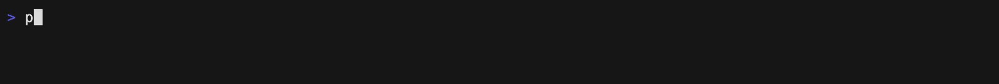
</p>

## Claude Code 側邊面板

不用離開 Claude Code，就能看到額度、其他對話與背景工作。支援 macOS 與 Windows。

<p align="center"></p>

**你會看到**

- **額度：** 5 小時與每週額度。
- **Claude 對話：** 等你回覆權限確認或 MCP 輸入的對話會標黃色。
- **對話通知：** 別的 Claude 對話完成或開始等你時，會跳出通知。
- **最新回覆：** 每個對話列的第二行會顯示最新回覆。
- **背景工作：** 包含 Claude 用 Agent 工具開的子代理，以及它們的狀態。

**開啟方式**

1. 在 usage 選單列選單（macOS）或系統匣選單（Windows）的 **Claude Code** 子選單裡，勾選 **側邊面板**。
2. 開新對話或執行 `/reload-plugins`。
3. 終端機寬度 ≥144 欄時，面板會自動在右邊打開；比較窄時輸入 `/usage-dash`。

<details>
<summary>相容性與更新</summary>

- 需要支援 mod 的新版 Claude Code，已測過 2.1.289。
- 面板只有在 Claude Code 的全螢幕介面才會放在右側，否則會顯示在輸入框上方。Windows 版開啟面板時會一併開啟全螢幕介面，關閉面板時改回。
- macOS 內建 Terminal 只支援 256 色，可能出現灰底；到 `/config` 選 ANSI 深色主題。
- usage app 啟動時，會把已開啟的面板自動更新到內附版本。

</details>

## Windows 支援

Windows 可完整使用核心功能：系統匣 UI、Claude Code 狀態列 hook 與 Codex 記錄解析都原生支援。從[最新 GitHub Release](https://github.com/aqua5230/usage/releases/latest)下載 `usage-windows.zip`，解壓後執行 `usage.exe` 即可，無須安裝程式。第一次執行若跳出 SmartScreen 的**「Windows 已保護您的電腦」**，按**「其他資訊」**→**「仍要執行」**。系統匣 UI 需要 Microsoft Edge WebView2 Runtime；Windows 10 與 11 通常已內建。

系統匣圖示顯示 Claude 或 Codex 目前工作階段額度的剩餘百分比。在右鍵選單或面板選單中選擇 **系統匣顯示來源 → Claude Code / Codex**，立即生效並於重啟後保留（預設 Claude）；Codex 沒有工作階段視窗時改用每週額度，並於提示文字中註明；沒有額度資料時顯示 `--`。提示文字摘要兩個工具的各視窗，並優先顯示所選來源。左鍵會用 WebView2 開啟與 macOS 相同的 16 款主題面板（預設加另外十五款）；右鍵也提供「重設面板位置」與「結束」；面板切換、重新整理、開機自啟與檢查更新都在面板選單。

在右鍵選單或面板選單中開啟 **顯示工作列額度**，即可在工作列內部、通知區域左側透明顯示 `Codex: 92%`。標籤自動跟隨工作列位置、螢幕縮放及明暗主題，全螢幕或工作列自動隱藏時隱藏；點擊文字開啟面板。空間不足時自動移至工作列外側，避免遮住按鈕。系統匣保留一般程式圖示作為選單入口；文字使用所選來源及額度視窗。 右鍵點標籤會開啟跟系統匣圖示一樣的選單。

Windows 的差異：面板開在工作區右下角，而非貼齊系統匣圖示；更新提示使用系統 Yes/No 對話框。

### 程式碼簽章政策

Free code signing provided by [SignPath.io](https://about.signpath.io/), certificate by [SignPath Foundation](https://signpath.org/).

團隊角色：

- 提交者與審查者：[aqua5230](https://github.com/aqua5230)
- 批准者：[aqua5230](https://github.com/aqua5230)

隱私權政策：除非使用者或安裝、操作此程式的人員明確要求，否則本程式不會將任何資訊傳輸至其他網路系統。關於 `usage` 替你發出的網路呼叫及如何避免，請參閱[隱私與資料來源](#隱私與資料來源)。

## 主題展示

內建 **16 款可切換的視覺主題**，可直接在 UI 中切換：

<p align="center">
  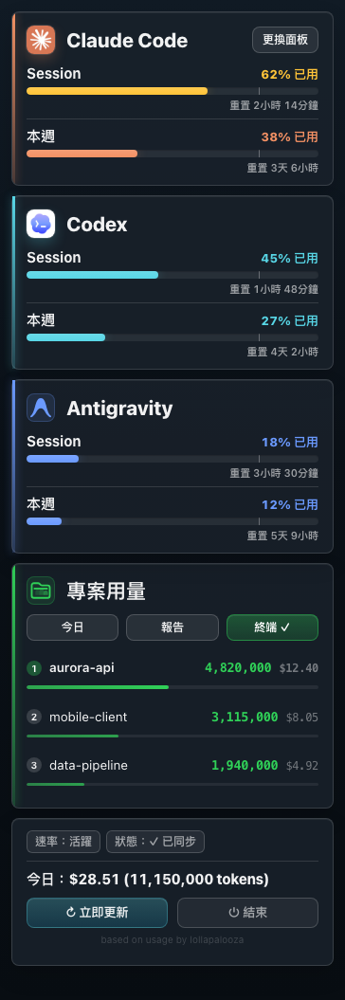
  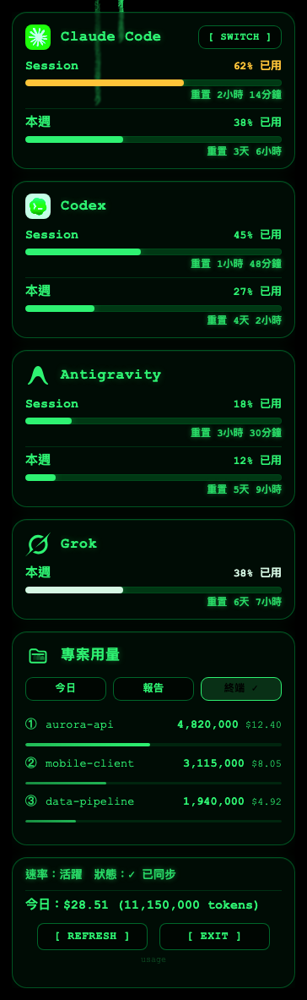
  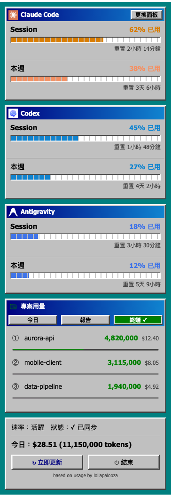
  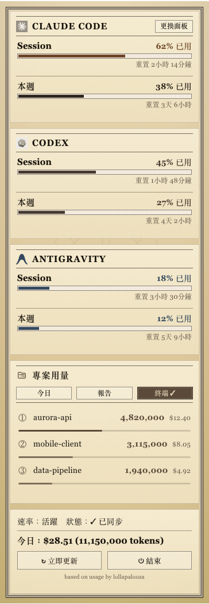
  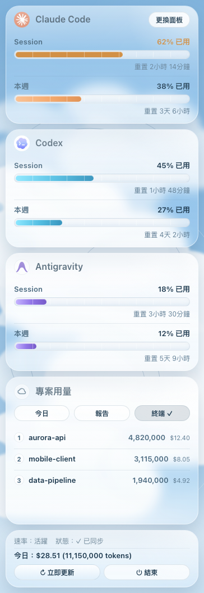
  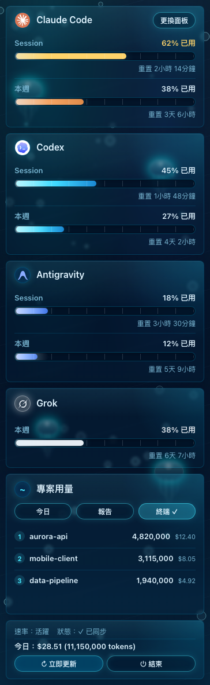
  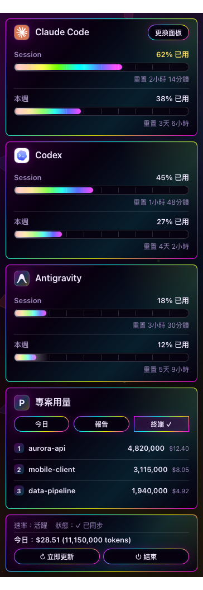
  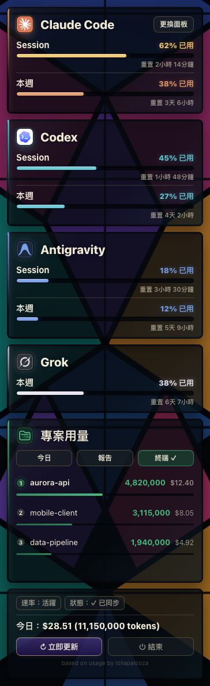
  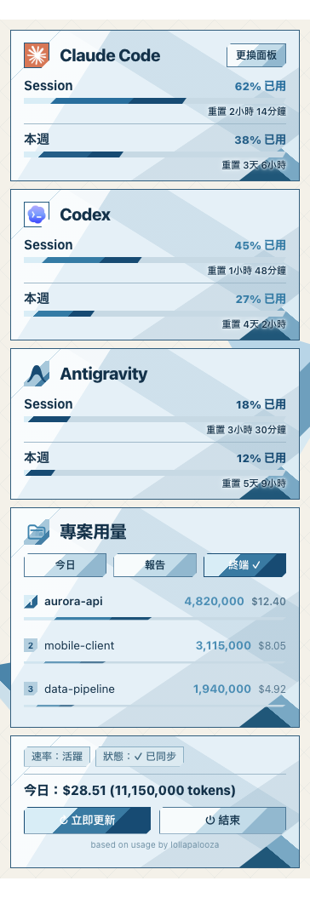
  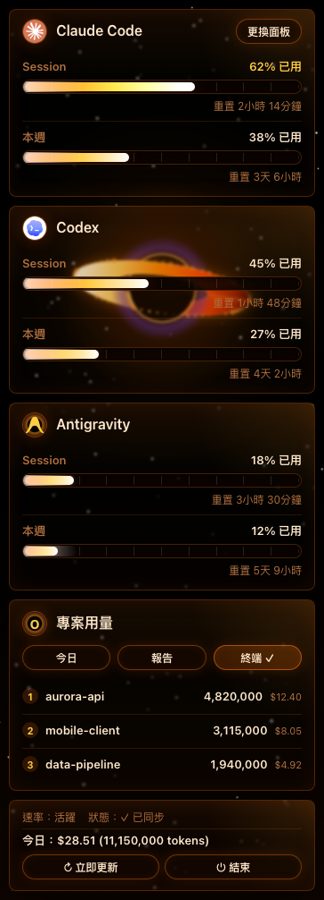
  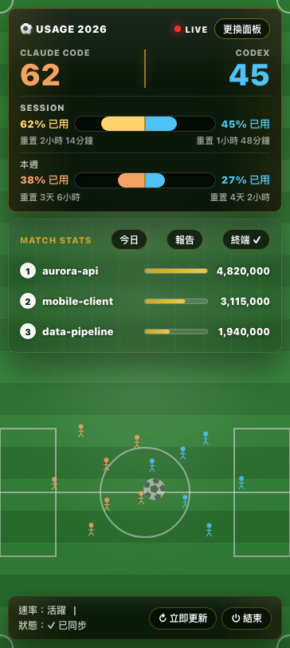
  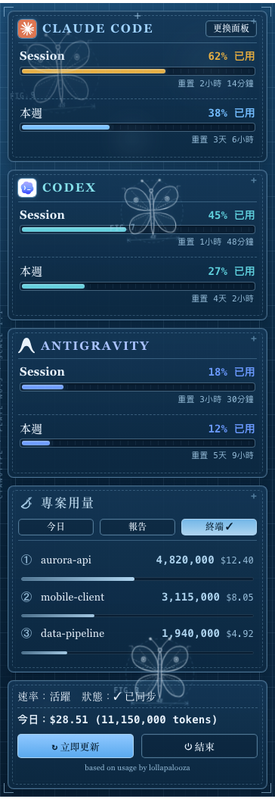
  
  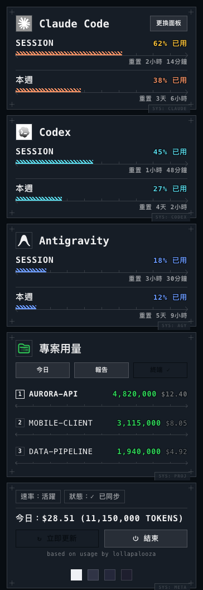
  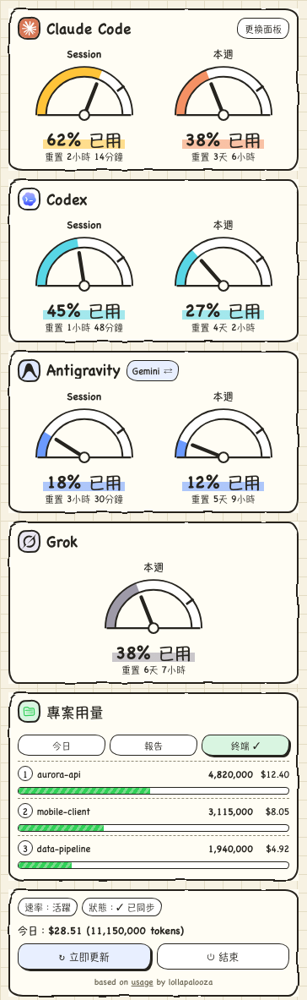
  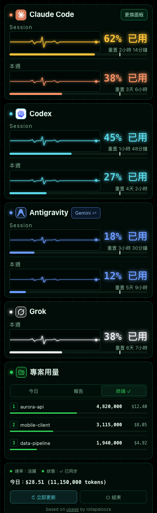
</p>

## 常見問題排查

如果顯示 `--` 先別急，絕大多數情況只是還沒有本機資料。

| 症狀 | 原因 | 解法 |
|------|------|------|
| menu bar 顯示 `--` | 尚無資料或 hook 未更新 | 先跑一次 Codex。若為 Claude Code，點擊「設定狀態列」（原始碼安裝則跑 `python3 main.py --setup`） |
| 執行 `usage.app` 裡的 `main.py` 出現 `ImportError` | 打包版的 `main.py` 要用 app 內建的直譯器，無法手動執行 | 別跑那份。改點 app 裡的「設定狀態列」，或 clone 原始碼從原始碼執行 |
| 不小心按到「結束」 | 程式已終止 | 透過 Spotlight 或應用程式重新開啟 `usage.app`。（`launchctl start com.lollapalooza.usage` 只在你開啟過「開機自啟」時才有作用。） |
| 顯示「N 分鐘未更新」 | Claude Code 未執行 | 打開 Claude Code 跑一下就會更新 |
| Codex 區塊空白 | 找不到 Codex 紀錄 | 用 Codex 跑一次對話 |
| 今日花費是 $0.00 | 價格表對不上或抓取失敗 | 刪掉 `~/.usage/pricing_cache.json` 重新抓取，或檢查 `USAGE_DEBUG=1` |
| Antigravity 卡片沒出現 | 未安裝或未登入 Antigravity CLI | 安裝並登入 Antigravity CLI，背景額度查詢成功後卡片會自動出現 |
| App 打不開 | Gatekeeper 擋住 | macOS 15 以上：系統設定 → 隱私權與安全性 → 往下捲 → 強制打開。macOS 14 以前：Finder → 找到 `usage.app` → 按右鍵 → 打開 |
| Windows 跳出「Windows 已保護您的電腦」 | SmartScreen 還不認得這個下載檔 | 按「其他資訊」→「仍要執行」 |

## 跟其他工具比較

| 功能 | usage | ccusage | TokenTracker |
|------|:-----:|:-------:|:------------:|
| 一直在螢幕上 | ✅ | — | ✅ |
| macOS 選單列與 Windows 系統匣 | ✅ | — | 僅 macOS |
| Claude Code 與 Codex 支援 | ✅ | 僅 Claude | ✅ |
| Antigravity 支援（Gemini 與 Claude / GPT） | ✅ | — | — |
| Grok CLI 支援 | ✅ | — | — |
| Muse Code token 花費 | ✅ | — | — |
| Claude Code 與 Codex 服務狀態警示 | ✅ | — | — |
| HTML 深度報告與 UI 面板 | ✅ | ✅ | — |
| AI 更新日報 | ✅ | — | — |
| 進度管家與省 token 模式 | ✅ | — | — |
| Token 浪費健檢 | ✅ | — | — |
| Claude Code 新手模式與額度感知模式 | ✅ | — | — |
| 開源授權 | AGPL-3.0 | MIT | — |

## 不適合誰

- 你完全生活在終端機裡，不想要任何背景執行的選單列圖示——單次執行的 CLI 工具會更適合你。
- 你沒有在使用 Claude Code、Codex、Antigravity 或 Grok CLI——因為這樣 `usage` 就沒有可以讀取的本機用量資料。
- 你想在 Linux 上用選單列。目前只有 macOS 與 Windows 有，不過終端機介面（`uvx usage-cli`）在 Linux 上跑得起來。

## 開發

從原始碼建置、設定自訂 agent 或執行終端機 TUI？請參閱 **[開發文件 (docs/DEVELOPMENT.zh-TW.md)](DEVELOPMENT.zh-TW.md)**。

## 授權

採用 AGPL-3.0-only（見 [LICENSE](../LICENSE)）。若 fork 或發佈衍生版本，請標注原作者與專案連結：
https://github.com/aqua5230/usage
